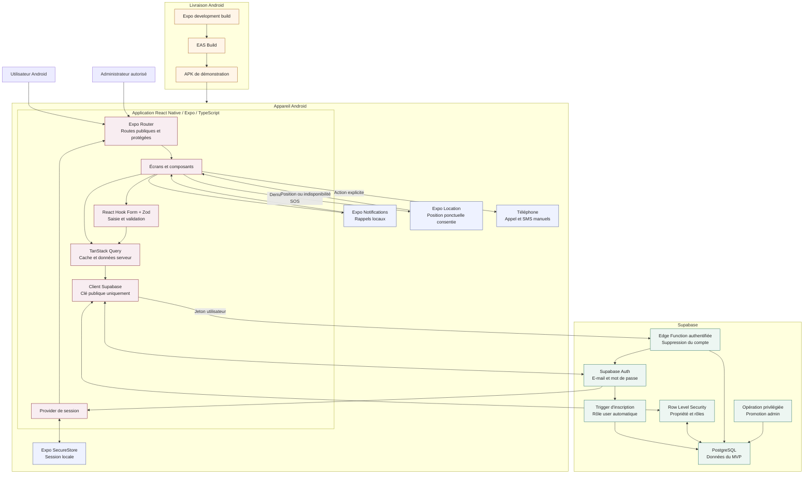
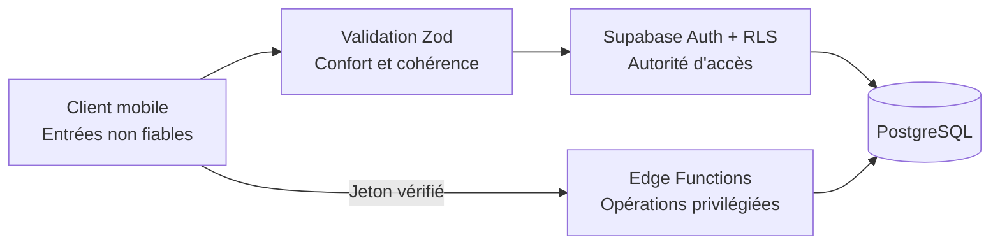

# Architecture du MVP

## Vue d'ensemble

DRÉPA est une application Android React Native exécutée avec Expo et écrite en TypeScript. Expo Router organise la navigation. Supabase fournit l'authentification, PostgreSQL, la RLS et les Edge Functions.

## Responsabilités des couches

### Application mobile

- `app/` contient les routes et layouts Expo Router.
- Les écrans délèguent la validation à React Hook Form et Zod.
- TanStack Query gère les requêtes, mutations, erreurs réseau et invalidations ciblées.
- Le client Supabase utilise uniquement l'URL et la clé publiques prévues pour le mobile.
- Le provider de session restaure l'authentification avant les redirections.
- Le cache privé est purgé à la déconnexion ou au changement d'utilisateur.

### Services de l'appareil

- Expo SecureStore conserve la session sans devenir une base de données médicale hors ligne.
- Expo Notifications programme localement les rappels de médicaments.
- Expo Location est appelée uniquement après confirmation du SOS et consentement à la permission.
- Les appels et SMS sont ouverts dans les applications du téléphone ; ils ne sont pas envoyés automatiquement.

### Supabase

- Supabase Auth gère l'inscription, la connexion, la récupération et les sessions.
- Un trigger contrôlé côté base attribue le rôle `user` à chaque nouveau compte.
- PostgreSQL conserve les données synchronisées et les migrations en constituent la source de vérité.
- La RLS limite les données privées à leur propriétaire et vérifie les privilèges de modération.
- La promotion vers `admin` passe exclusivement par une opération privilégiée côté Supabase.
- Une Edge Function authentifiée réalise la suppression sécurisée du compte.

## Frontières de confiance

La validation mobile améliore l'expérience mais n'accorde aucun droit. Supabase Auth, les contraintes PostgreSQL, la RLS et les vérifications serveur restent les autorités de sécurité.

## Flux principaux

| Flux | Chemin | Protection |
|---|---|---|
| Authentification | Mobile → Supabase Auth → SecureStore | Session vérifiée et stockage local sécurisé. |
| Données privées | Mobile → client Supabase → RLS → PostgreSQL | Filtre propriétaire avec `auth.uid()`. |
| Communauté | Mobile → RLS → tables communautaires | Contenus visibles séparés des données médicales. |
| Modération | Administrateur → RLS ou fonction sécurisée → contenu | Rôle `admin` vérifié côté Supabase. |
| Suppression du compte | Mobile → Edge Function → Auth et PostgreSQL | Identité de l'appelant vérifiée ; privilèges confinés au serveur. |
| Rappel | Application → notifications locales → utilisateur | Aucun service distant requis pour l'affichage local. |
| SOS | Utilisateur → confirmation → localisation facultative → enregistrement → téléphone | Consentement, fonctionnement sans position et actions manuelles. |

## Contraintes d'architecture

- Android est la seule plateforme développée, testée et livrée dans le MVP.
- Aucun secret serveur n'est intégré au bundle mobile.
- La localisation n'est jamais collectée en permanence.
- Les données du journal, du profil médical et des contacts ne sont jamais exposées à la communauté.
- L'application ne produit aucun diagnostic, aucune prescription et aucune prédiction de crise.
- Les rappels et le SOS sont des aides sans garantie de prise ni de prise en charge.
