# Diagramme des classes métier

Le diagramme représente les concepts du MVP indépendamment de leur implémentation React Native ou Supabase. `User` correspond au compte géré par Supabase Auth.

```mermaid
classDiagram
    class User {
        +UUID id
        +string email
        +datetime createdAt
    }

    class Profile {
        +UUID id
        +string firstName
        +string fullName
        +date dateOfBirth
        +string drepanocytosisType
        +string country
        +string city
        +string bloodGroup
        +string allergies
        +string careCenter
        +string doctorName
        +string doctorPhone
        +datetime createdAt
        +datetime updatedAt
        +isComplete() boolean
    }

    class UserRole {
        +UUID userId
        +Role role
        +datetime createdAt
        +datetime updatedAt
    }

    class UserConsent {
        +UUID id
        +UUID userId
        +string termsVersion
        +string privacyVersion
        +string communityGuidelinesVersion
        +datetime acceptedAt
        +datetime revokedAt
        +isCurrent() boolean
    }

    class EmergencyContact {
        +UUID id
        +UUID userId
        +string name
        +string phone
        +string whatsappPhone
        +string relationship
        +boolean isPrimary
        +boolean consentConfirmed
        +datetime createdAt
    }

    class HealthLog {
        +UUID id
        +UUID userId
        +int painLevel
        +string painLocation
        +decimal temperature
        +string hydrationLevel
        +int fatigueLevel
        +stringArray symptoms
        +stringArray possibleTriggers
        +boolean medicationTaken
        +string notes
        +datetime recordedAt
        +datetime createdAt
        +datetime updatedAt
    }

    class Medication {
        +UUID id
        +UUID userId
        +string name
        +string dosage
        +string frequency
        +date startDate
        +date endDate
        +boolean isActive
        +string note
        +datetime createdAt
        +datetime updatedAt
    }

    class MedicationReminder {
        +UUID id
        +UUID userId
        +UUID medicationId
        +time reminderTime
        +boolean isEnabled
        +datetime createdAt
    }

    class MedicationIntake {
        +UUID id
        +UUID userId
        +UUID medicationId
        +datetime scheduledAt
        +datetime takenAt
        +IntakeStatus status
    }

    class SosEvent {
        +UUID id
        +UUID userId
        +decimal latitude
        +decimal longitude
        +boolean locationShared
        +int painLevel
        +stringArray contactsCalled
        +boolean messagePrepared
        +datetime createdAt
        +datetime resolvedAt
    }

    class EducationalResource {
        +UUID id
        +string title
        +string summary
        +string content
        +string source
        +string contentVersion
        +boolean isPublished
        +datetime createdAt
        +datetime updatedAt
    }

    class CommunityPost {
        +UUID id
        +UUID userId
        +string content
        +string category
        +string country
        +boolean isHidden
        +datetime createdAt
        +datetime updatedAt
    }

    class CommunityComment {
        +UUID id
        +UUID postId
        +UUID userId
        +string content
        +boolean isHidden
        +datetime createdAt
    }

    class CommunityPostReaction {
        +UUID id
        +UUID postId
        +UUID userId
        +ReactionType reactionType
        +datetime createdAt
    }

    class CommunityReport {
        +UUID id
        +UUID reporterId
        +UUID postId
        +UUID commentId
        +string reason
        +ReportStatus status
        +datetime createdAt
        +datetime reviewedAt
    }

    class Role {
        <<enumeration>>
        user
        admin
    }

    class ReactionType {
        <<enumeration>>
        support
    }

    class IntakeStatus {
        <<enumeration>>
        taken
        skipped
        postponed
    }

    class ReportStatus {
        <<enumeration>>
        pending
        resolved
        rejected
    }

    User "1" *-- "0..1" Profile : possède
    User "1" *-- "1" UserRole : reçoit
    UserRole --> Role : utilise
    User "1" *-- "0..*" UserConsent : accepte
    User "1" *-- "0..*" EmergencyContact : configure
    User "1" *-- "0..*" HealthLog : enregistre
    User "1" *-- "0..*" Medication : déclare
    Medication "1" *-- "0..*" MedicationReminder : planifie
    Medication "1" *-- "0..*" MedicationIntake : produit
    User "1" *-- "0..*" SosEvent : déclenche
    User "1" --> "0..*" CommunityPost : publie
    User "1" --> "0..*" CommunityComment : commente
    User "1" --> "0..*" CommunityPostReaction : soutient
    User "1" --> "0..*" CommunityReport : signale
    CommunityPost "1" *-- "0..*" CommunityComment : contient
    CommunityPost "1" *-- "0..*" CommunityPostReaction : reçoit
    CommunityPost "1" --> "0..*" CommunityReport : peut être signalée
    CommunityComment "0..1" --> "0..*" CommunityReport : peut être signalé
    CommunityPostReaction --> ReactionType : utilise
    MedicationIntake --> IntakeStatus : utilise
    CommunityReport --> ReportStatus : utilise
    UserRole --> EducationalResource : administre si admin

    note for HealthLog "Seul recordedAt est obligatoire; les mesures sont facultatives"
    note for CommunityPostReaction "Une réaction support maximum par utilisateur et publication"
    note for UserRole "Le mobile ne peut jamais modifier le rôle"
```

## Invariants métier

- `Profile.isComplete()` exige un prénom ou pseudonyme, un pays et des consentements courants non révoqués.
- `HealthLog.recordedAt` est obligatoire ; les mesures et observations sont facultatives.
- Une valeur de douleur ou fatigue présente est comprise entre 0 et 10.
- Un seul contact principal est autorisé par utilisateur.
- Une seule réaction `support` est autorisée par couple utilisateur-publication.
- Un traitement représente uniquement une information déclarée comme prescrite.
- Les ressources éducatives et les actions de modération sont contrôlées par un rôle `admin` vérifié côté Supabase.
