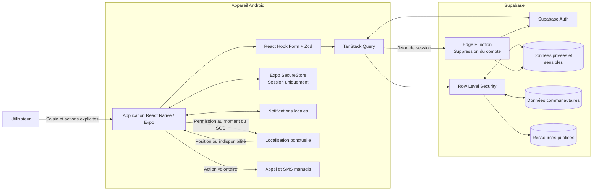
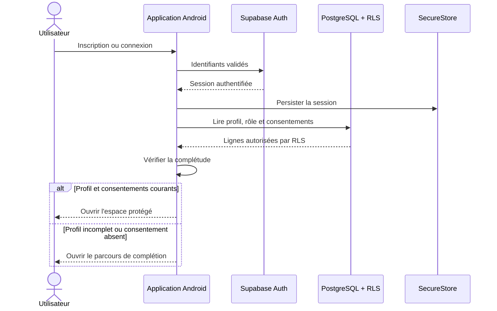
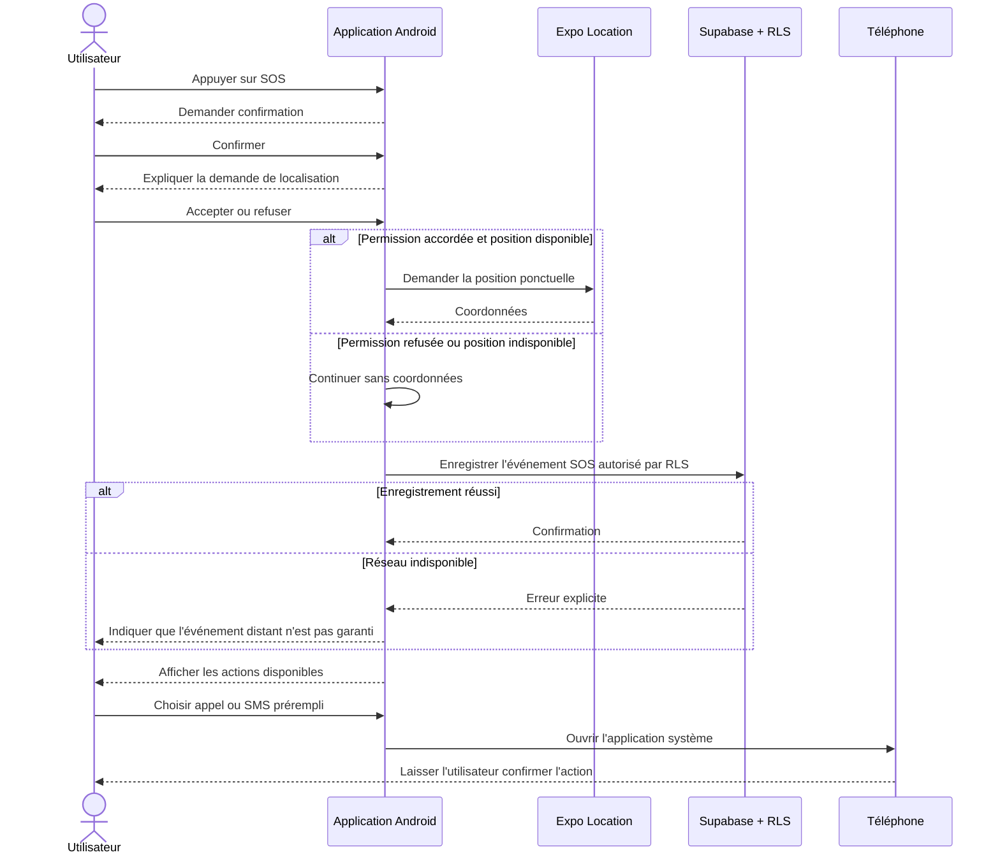
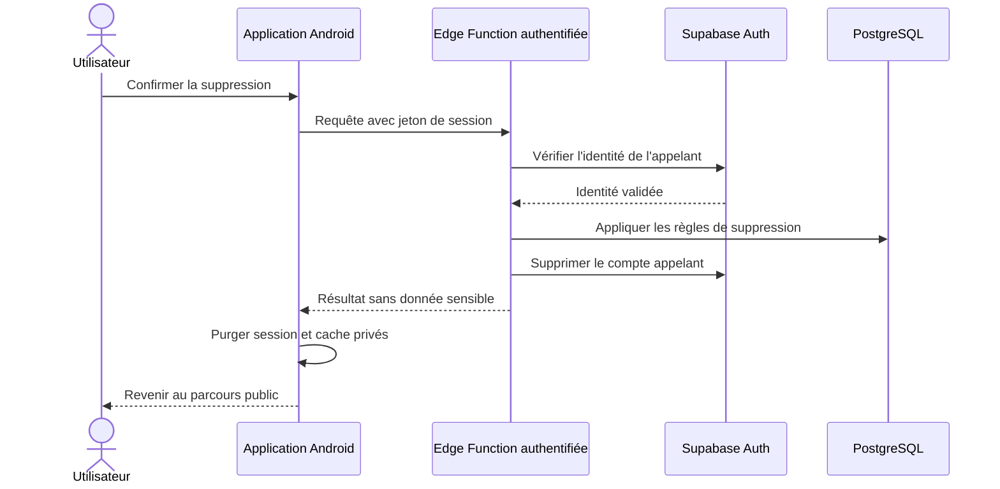

# Flux de données du MVP

## Principes

- L'application Android collecte uniquement les données nécessaires au parcours demandé.
- Supabase Auth établit l'identité ; PostgreSQL et la RLS contrôlent l'accès aux données.
- Les Edge Functions sont réservées aux opérations serveur privilégiées, notamment la suppression du compte.
- Les données médicales déclarées, les contacts et la localisation ne sont jamais exposés à la communauté.
- Les notifications de médicaments sont programmées localement sur le téléphone.

## Vue générale

## Classification des données

| Classe | Exemples | Accès attendu |
|---|---|---|
| Privées | profil, consentements, contacts, médicaments, rappels | Propriétaire uniquement, selon la RLS. |
| Sensibles | journal de santé, prises, événements SOS, coordonnées de localisation | Propriétaire uniquement ; aucun accès administrateur global implicite. |
| Communautaires | publications, commentaires, réactions `support` | Membres authentifiés selon les politiques de visibilité. |
| De modération | signalements, statut de traitement, masquage | Auteur pour la création ; administrateur vérifié pour le traitement. |
| Publiées | ressources éducatives marquées `is_published` | Lecture par les utilisateurs ; écriture réservée aux administrateurs. |
| Locales | session, identifiants de notifications programmées | Conservées sur l'appareil avec le mécanisme adapté. |

## Flux d'authentification et de profil

Le rôle `user` est créé automatiquement côté Supabase après l'inscription. Le mobile ne transmet jamais un rôle à attribuer.

## Flux des données privées

1. L'utilisateur saisit une donnée dans l'application.
2. Zod valide le format et les contraintes d'interface.
3. TanStack Query transmet la requête avec la session active.
4. Supabase Auth identifie l'utilisateur.
5. La RLS vérifie que `auth.uid()` correspond au propriétaire.
6. PostgreSQL applique ses contraintes et enregistre la ligne.
7. Le cache concerné est invalidé puis actualisé.
8. Une erreur réseau conserve un état explicite sans afficher de donnée sensible dans les journaux.

La validation mobile améliore l'expérience, mais seules les contraintes PostgreSQL et la RLS font autorité.

## Flux communautaire

- Les publications et commentaires visibles sont séparés des tables médicales.
- Une réaction est limitée à `support` et au couple unique `(post_id, user_id)`.
- Un membre peut modifier ou supprimer uniquement son propre contenu selon les règles du MVP.
- Un signalement est transmis à `community_reports` sans rendre publiques les données du déclarant.
- Le masquage et le traitement d'un signalement exigent un rôle `admin` vérifié côté Supabase.

## Flux SOS

Le SOS ne collecte pas la position en continu, n'envoie pas automatiquement de message et ne garantit pas l'intervention d'un tiers.

## Suppression du compte

Aucune clé privilégiée ne transite par l'application mobile.
