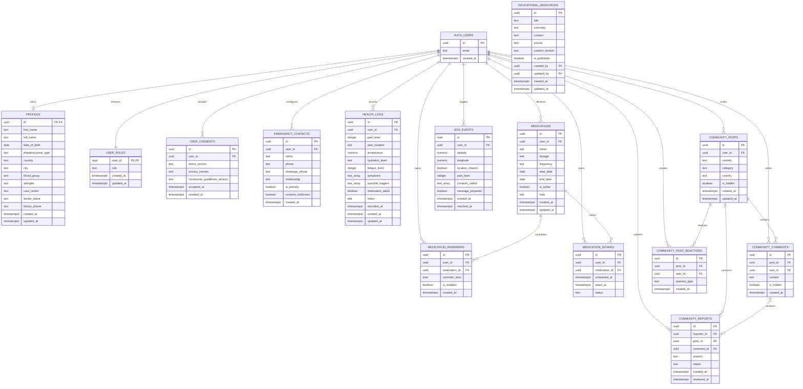

# Schéma de base de données du MVP

Supabase PostgreSQL est la source de vérité des données synchronisées. Toutes les tables exposées au client mobile activent Row Level Security avant leur utilisation.

## Relations

Dans le diagramme, `AUTH_USERS` représente `auth.users`. Les autres noms correspondent aux tables du schéma `public` en minuscules.

## Ordre des migrations

Chaque étape est une migration distincte et versionnée :

1. `profiles`
2. `user_roles`
3. `user_consents`
4. `emergency_contacts`
5. `health_logs`
6. `medications`
7. `medication_reminders`
8. `medication_intakes`
9. `sos_events`
10. `educational_resources`
11. `community_posts`
12. `community_comments`
13. `community_post_reactions`
14. `community_reports`

Chaque migration ajoute ses contraintes, index, activation RLS et politiques associées. Une évolution ultérieure du schéma passe par une nouvelle migration, jamais par la modification d'une migration déjà appliquée.

## Contraintes essentielles

| Table | Contraintes |
|---|---|
| `profiles` | `id` référence `auth.users(id)` avec suppression en cascade ; longueurs de texte limitées. |
| `user_roles` | `user_id` unique ; `role IN ('user', 'admin')` ; rôle initial `user` créé automatiquement. |
| `user_consents` | versions et `accepted_at` obligatoires ; `revoked_at` facultatif ; historique conservé. |
| `emergency_contacts` | nom et téléphone obligatoires ; consentement confirmé ; un seul contact principal par utilisateur. |
| `health_logs` | `recorded_at` obligatoire ; douleur et fatigue facultatives mais limitées de 0 à 10 ; date future refusée pour une entrée passée. |
| `medications` | nom, dosage déclaré, fréquence et date de début obligatoires ; date de fin postérieure ou égale au début. |
| `medication_reminders` | médicament et heure obligatoires ; plusieurs lignes permettent plusieurs horaires. |
| `medication_intakes` | statut limité à `taken`, `skipped` ou `postponed`. |
| `sos_events` | coordonnées facultatives ; `location_shared` indique explicitement leur partage. |
| `educational_resources` | titre, contenu, source et version obligatoires ; publication réservée aux administrateurs ; `created_by` et `updated_by` référencent `auth.users(id)` et doivent correspondre à un administrateur dans `user_roles`. |
| `community_posts` | contenu et catégorie obligatoires ; auteur immuable. |
| `community_comments` | publication, auteur et contenu obligatoires. |
| `community_post_reactions` | `reaction_type = 'support'` ; unicité de `(post_id, user_id)`. |
| `community_reports` | une publication ou un commentaire doit être ciblé, mais pas les deux ; statut limité à `pending`, `resolved` ou `rejected`. |

Toutes les clés étrangères liées à un utilisateur utilisent `ON DELETE CASCADE`, sous réserve des règles de conservation validées. Les relations vers une publication ou un commentaire supprimé doivent conserver une stratégie cohérente avec la traçabilité de modération.

## Matrice RLS

| Domaine | Utilisateur | Administrateur |
|---|---|---|
| Profil, consentements, contacts, journal, médicaments, prises et SOS | CRUD sur ses propres lignes selon les règles métier. | Aucun accès global implicite aux données médicales privées. |
| `user_roles` | Lecture de son rôle seulement ; aucune écriture depuis le mobile. | Promotion uniquement par opération Supabase privilégiée. |
| Ressources éducatives | Lecture des ressources publiées. | Création, modification, publication et retrait. |
| Publications et commentaires | Lecture des contenus visibles ; création et gestion de son propre contenu. | Masquage pour modération. |
| Réactions | Lecture, ajout et retrait de sa propre réaction `support`. | Aucun privilège supplémentaire nécessaire. |
| Signalements | Création et lecture limitée selon la politique retenue. | Consultation et traitement après vérification du rôle côté Supabase. |

La clé publique du client ne remplace jamais la RLS. Aucune opération administrative ne dépend d'une valeur de rôle fournie par l'application mobile.

## Suppression du compte

Une Edge Function authentifiée vérifie l'identité de l'appelant puis supprime son compte avec les privilèges serveur nécessaires. Les clés privilégiées restent côté serveur. Les suppressions en cascade retirent les données personnelles conformément aux règles de conservation du MVP.
