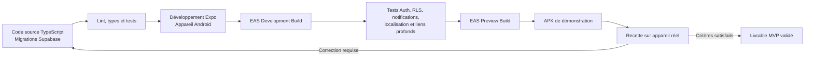
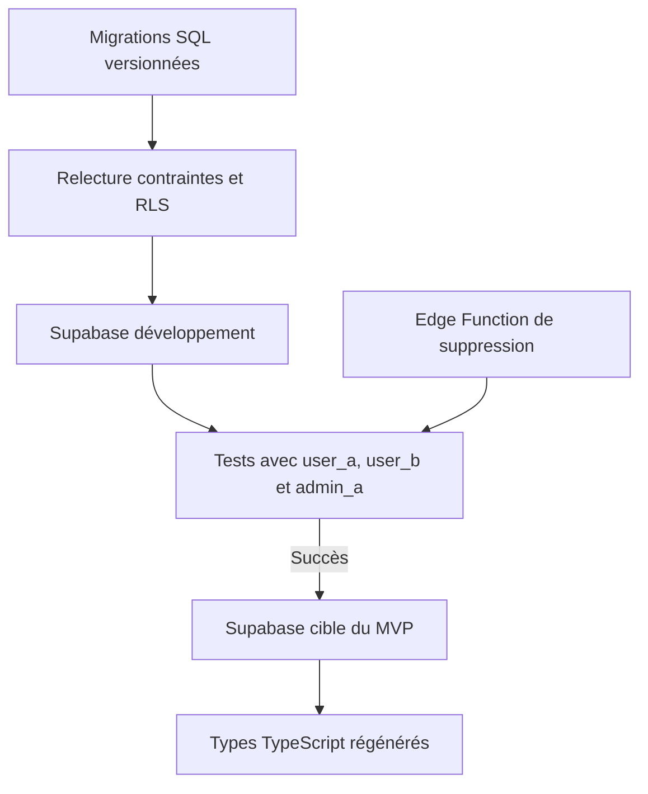

# Déploiement Android du MVP

## Objectif

La chaîne de livraison produit un APK Android démontrable à partir du projet React Native, Expo et TypeScript. Android est l'unique plateforme développée, testée et livrée dans le MVP.

## Chaîne de livraison

## Environnements

| Environnement | Usage | Données |
|---|---|---|
| Développement local | Construction des écrans et validation rapide sur Android. | Données fictives uniquement. |
| Développement partagé | Tests d'intégration avec un projet Supabase non productif. | Comptes de test sans données médicales réelles. |
| Preview | APK candidat destiné à la recette du MVP. | Jeu de démonstration contrôlé. |
| Production MVP | Environnement validé pour la démonstration finale ou un pilote autorisé. | Collecte minimale selon les consentements et politiques approuvés. |

Chaque environnement utilise sa propre configuration Supabase. Aucun secret serveur n'est placé dans le dépôt, le bundle mobile ou les fichiers de documentation.

## Configuration Expo

La configuration Android doit définir :

- le nom `DRÉPA` et le slug `drepa` ;
- un identifiant de package Android stable avant le premier build distribué ;
- le schéma de lien profond utilisé par l'authentification ;
- le plugin Expo Router ;
- les plugins SecureStore, Notifications et Location ;
- des messages français expliquant les permissions ;
- une icône, un écran de démarrage et les métadonnées du MVP ;
- une version applicative et un numéro de build Android incrémentés.

Les permissions sont limitées aux fonctions du MVP. Aucune permission de localisation en arrière-plan n'est demandée.

## Variables d'environnement

Le client mobile reçoit uniquement la configuration publique nécessaire pour joindre Supabase et identifier l'environnement applicatif. Les fichiers d'exemple ne contiennent aucune valeur réelle.

- Les variables publiques Expo sont intégrées au bundle et ne sont donc pas des secrets.
- Les privilèges serveur de suppression de compte restent dans l'environnement de l'Edge Function.
- Une valeur de rôle administrateur ne provient jamais d'une variable mobile.
- Les environnements de développement, preview et production ne partagent pas leurs valeurs.
- Les fichiers locaux contenant des valeurs sont ignorés par le contrôle de version.

## Étapes de développement

1. Initialiser le projet Expo TypeScript avec Expo Router.
2. Installer les modules avec les versions compatibles avec le SDK Expo retenu.
3. Vérifier l'affichage sur un appareil Android.
4. Configurer Supabase Auth, les migrations et la RLS dans l'environnement de développement.
5. Tester les parcours simples dans Expo lorsque les modules utilisés le permettent.
6. Passer rapidement à un development build pour les notifications, liens profonds et configurations natives.
7. Corriger les erreurs de typage, lint et validation avant tout build partagé.

Expo Go peut servir aux premiers écrans, mais ne constitue pas la preuve finale de compatibilité du MVP.

## Development build

Le profil EAS `development` produit un client Android destiné à l'équipe de développement.

Il sert à vérifier :

- la restauration de session SecureStore ;
- les liens de confirmation et de récupération ;
- les notifications locales ;
- la demande ponctuelle de localisation ;
- l'ouverture de l'appel et du SMS ;
- les redirections Expo Router ;
- le comportement du bouton retour Android.

## Build preview et APK

Le profil EAS `preview` produit un APK installable pour la démonstration et la recette.

Avant sa génération :

- figer les migrations attendues ;
- appliquer et tester toutes les politiques RLS ;
- déployer l'Edge Function de suppression de compte ;
- vérifier la configuration d'authentification et des liens profonds ;
- confirmer les textes de consentement et leurs versions ;
- vérifier les mentions médicales et les limites du SOS ;
- utiliser uniquement des contenus éducatifs validés et sourcés ;
- retirer les données de test inutiles.

L'APK est installé sur au moins un appareil Android représentatif de la cible, avec test en réseau normal, lent et indisponible.

## Déploiement Supabase

L'ordre des migrations suit `database-schema.md`. Une migration appliquée n'est pas réécrite ; toute correction passe par une nouvelle migration.

## Recette avant livraison

### Compte et sécurité

- inscription, connexion, récupération, restauration et déconnexion ;
- rôle `user` attribué automatiquement ;
- impossibilité de modifier son rôle depuis le mobile ;
- consentements courants acceptables et révocables ;
- suppression du compte par Edge Function ;
- isolation RLS vérifiée avec deux utilisateurs et un administrateur.

### Fonctions Android

- rappel local reçu avec permission accordée ;
- comportement explicite lorsque les notifications sont refusées ;
- SOS testé avec localisation accordée, refusée et indisponible ;
- appel et SMS ouverts manuellement ;
- liens profonds d'authentification fonctionnels dans l'APK ;
- navigation retour sans contournement des protections.

### Parcours métier

- profil complet uniquement avec identité minimale et consentements courants ;
- entrée de journal contenant seulement `recorded_at` acceptée ;
- historique et statistiques descriptives ;
- traitement déclaré, rappels et prises ;
- publications, commentaires, réaction `support` unique et signalements ;
- modération et ressources réservées à un administrateur vérifié côté Supabase.

## Livraison

Le livrable comprend :

- l'APK Android de démonstration ;
- le code source correspondant ;
- les migrations et politiques RLS versionnées ;
- l'Edge Function de suppression du compte ;
- la documentation d'installation et de recette ;
- la liste des fonctionnalités réalisées et des limites connues.

La livraison n'inclut aucun diagnostic, aucune prescription, aucune prédiction de crise et aucune garantie de fonctionnement du SOS.

## Retour arrière

- Conserver l'APK précédemment validé jusqu'à acceptation du nouveau candidat.
- Ne pas annuler une migration appliquée par une modification destructive improvisée.
- Préparer une migration corrective compatible avec les données existantes.
- Désactiver une fonction à risque côté serveur si nécessaire, sans exposer les données privées.
- Documenter la version de l'application, le numéro de build et les migrations associées à chaque APK.
