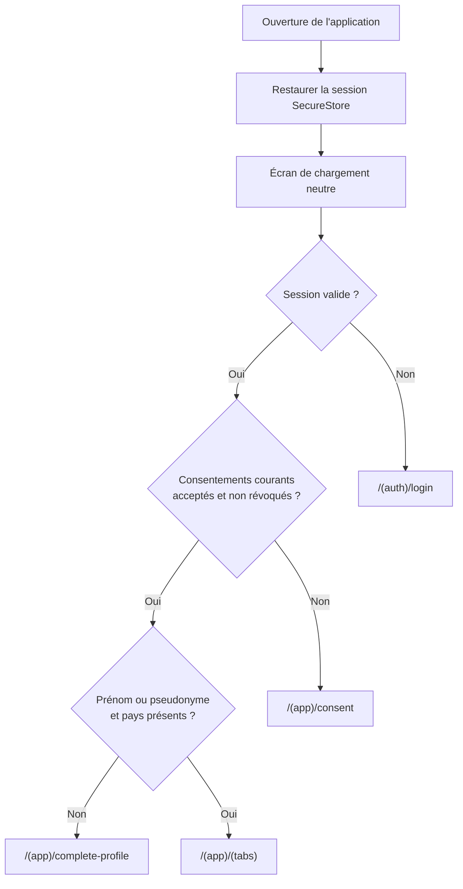
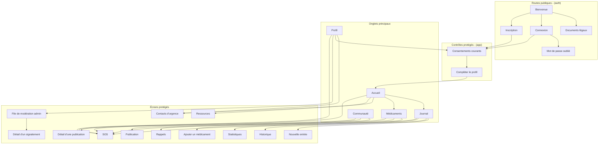

# Navigation du MVP

Expo Router fournit une navigation basée sur les fichiers. Les groupes de routes séparent les parcours publics, les contrôles de complétude et l'espace authentifié sans modifier les URL visibles avec le nom des groupes.

## Décision d'entrée



Une seule couche décide de la redirection initiale après la restauration de session. Aucun layout ne déclenche une redirection concurrente pendant l'état de chargement.

## Arborescence des routes

```text
app/
├── _layout.tsx
├── index.tsx
├── +not-found.tsx
├── (auth)/
│   ├── _layout.tsx
│   ├── welcome.tsx
│   ├── legal.tsx
│   ├── login.tsx
│   ├── register.tsx
│   └── forgot-password.tsx
└── (app)/
    ├── _layout.tsx
    ├── consent.tsx
    ├── complete-profile.tsx
    ├── health-entry.tsx
    ├── health-history.tsx
    ├── health-statistics.tsx
    ├── medication-form.tsx
    ├── medication-reminders.tsx
    ├── emergency-contacts.tsx
    ├── resources.tsx
    ├── community-post-form.tsx
    ├── community-post/[id].tsx
    ├── admin/
    │   ├── _layout.tsx
    │   ├── moderation.tsx
    │   └── report/[id].tsx
    ├── sos.tsx
    └── (tabs)/
        ├── _layout.tsx
        ├── index.tsx
        ├── journal.tsx
        ├── medications.tsx
        ├── community.tsx
        └── profile.tsx
```

L'arborescence est une cible documentaire. Les fichiers seront créés progressivement selon le planning du MVP.

## Carte de navigation



## Routes publiques

- `welcome` présente DRÉPA et ses limites.
- `legal` permet de consulter les documents avant l'inscription ; l'acceptation versionnée est enregistrée seulement après identification de l'utilisateur.
- `login` et `register` gèrent l'accès par e-mail et mot de passe.
- `forgot-password` démarre la récupération du mot de passe.
- Un utilisateur déjà authentifié est redirigé vers le contrôle de consentement, de profil ou vers les onglets.

## Routes protégées et contrôles

Le layout `(app)` refuse tout accès sans session valide. Il ne se contente pas de masquer l'interface.

- Sans consentements courants, seule la route de consentement et les actions nécessaires au compte restent accessibles.
- Avec les consentements mais sans prénom ou pseudonyme et pays, l'utilisateur est dirigé vers `complete-profile`.
- Après complétion, les onglets et écrans métier deviennent accessibles.
- Une révocation renvoie l'utilisateur vers le parcours de consentement.
- `/(app)/admin/moderation` ouvre la file de modération, exposée sous `/admin/moderation` par Expo Router.
- `/(app)/admin/report/[id]` ouvre le détail et l'historique d'un signalement, sous `/admin/report/[id]`.
- Le layout `admin` applique un guard fondé sur le rôle propre au compte dans `user_roles`. Seul le rôle `admin` continue vers ces écrans.
- Ce guard mobile ne remplace pas les contrôles `is_admin()` des RPC Supabase de modération.

## Onglets

| Onglet | Contenu principal |
|---|---|
| Accueil | Résumé, prochain rappel, accès rapides, contacts et SOS. |
| Journal | Nouvelle entrée partielle, historique et statistiques descriptives. |
| Médicaments | Traitements déclarés comme prescrits, rappels et prises. |
| Communauté | Publications, commentaires, réactions `support` et signalements. |
| Profil | Profil, consentements, contacts, paramètres et suppression du compte. |

## Route SOS

`/(app)/sos` est une route protégée accessible depuis l'accueil et les principales pages. Elle ne fait pas partie des onglets afin de conserver un parcours dédié avec confirmation.

1. Afficher la confirmation.
2. Expliquer puis demander la permission de localisation.
3. Continuer si la permission ou la position est indisponible.
4. Enregistrer l'événement si le réseau le permet.
5. Présenter l'appel et le SMS prérempli comme actions manuelles.
6. Afficher les limites du service.

Le bouton SOS doit être visible sans provoquer de déclenchement accidentel.

## Liens profonds et récupération

- Le schéma de lien mobile est réservé à l'application Android DRÉPA.
- Un lien de récupération est traité par une route contrôlée avant d'autoriser le changement de mot de passe.
- Les paramètres inattendus ou expirés produisent un message neutre et un retour vers la connexion.
- Les liens sont testés dans un development build puis dans l'APK, pas uniquement dans Expo Go.

## Comportement Android

- Le bouton retour respecte la pile et ne contourne pas les contrôles de session ou de consentement.
- Après déconnexion ou suppression du compte, la pile protégée est remplacée par la pile publique.
- Une page inconnue affiche `+not-found` avec un retour sûr.
- Android est la seule plateforme couverte par le MVP.
