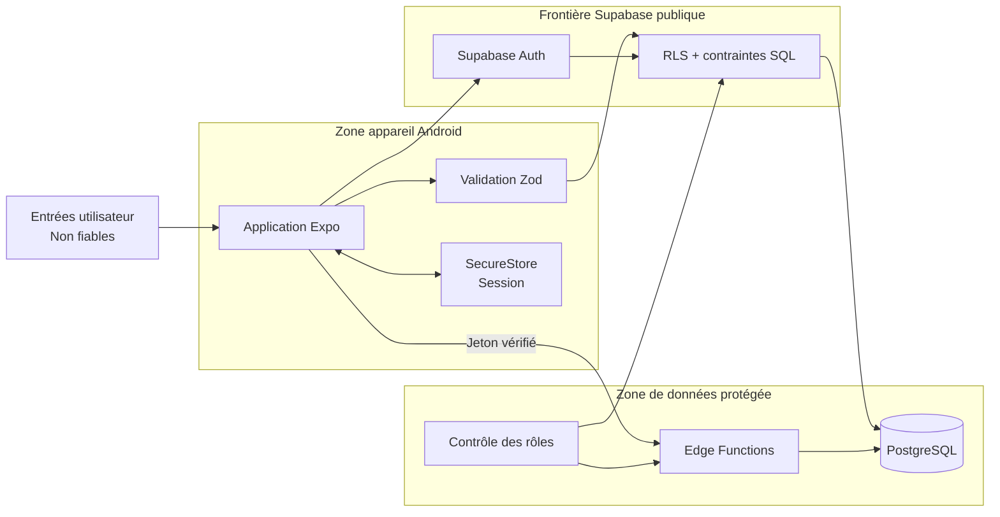

# Sécurité et confidentialité du MVP

## Objectifs

Le MVP traite des données personnelles et des données de santé déclarées. La sécurité repose sur une défense en profondeur : authentification, autorisation côté Supabase, contraintes de base de données, stockage local limité et opérations privilégiées confinées au serveur.

## Authentification

- Supabase Auth gère l'inscription, la connexion, la récupération du mot de passe et les sessions.
- Les mots de passe ne sont jamais stockés dans les tables applicatives.
- La session est restaurée avant toute décision de navigation protégée.
- La déconnexion supprime la session locale et purge les données privées du cache TanStack Query.
- Les jetons, mots de passe et liens de récupération ne sont jamais écrits dans les journaux applicatifs.
- Les redirections de récupération utilisent le schéma mobile configuré et sont testées sur un build Android réel.

## Row Level Security

La RLS est activée avant tout accès mobile à une table. La clé publique du client identifie le projet mais n'accorde aucun accès en l'absence de politique.

### Données privées et sensibles

Pour `profiles`, `user_consents`, `emergency_contacts`, `health_logs`, `medications`, `medication_reminders`, `medication_intakes` et `sos_events` :

- `select` vérifie que la ligne appartient à `auth.uid()` ;
- `insert` impose `user_id = auth.uid()` ou `id = auth.uid()` pour le profil ;
- `update` vérifie l'ancien et le nouveau propriétaire ;
- `delete` est limité au propriétaire ;
- aucun rôle administrateur ne reçoit automatiquement un accès global aux données médicales.

### Données communautaires

- Les membres authentifiés lisent uniquement les contenus autorisés et non masqués selon la politique retenue.
- Un auteur crée, modifie ou supprime uniquement son propre contenu.
- Une réaction `support` est créée ou supprimée uniquement par son propriétaire.
- Un signalement est créé au nom de `auth.uid()` ; son statut ne peut pas être modifié par le déclarant.
- Le masquage et le traitement des signalements exigent un rôle `admin` vérifié côté Supabase.

### Ressources éducatives

- Les utilisateurs lisent uniquement les ressources publiées.
- La création, la modification, la publication et le retrait sont réservés aux administrateurs.
- Le client ne peut pas obtenir ces droits en transmettant lui-même une valeur `admin`.

## Rôles

La table `user_roles` contient un rôle contraint à `user` ou `admin`.

- Un trigger Supabase attribue automatiquement `user` après l'inscription.
- Le mobile peut lire le rôle nécessaire à l'interface, mais ne peut jamais l'insérer, le modifier ou le supprimer.
- La promotion vers `admin` passe uniquement par une opération privilégiée contrôlée côté Supabase.
- Chaque politique administrative vérifie le rôle dans la base ou par une fonction serveur sécurisée.
- L'affichage conditionnel d'un bouton administrateur n'est jamais considéré comme une autorisation.

## Consentements

- `user_consents` conserve les versions des CGU, de la politique de confidentialité et de la charte communautaire.
- `accepted_at` enregistre l'acceptation et `revoked_at` une révocation éventuelle.
- Une acceptation valide correspond aux versions obligatoires courantes et n'est pas révoquée.
- Une révocation rend le profil incomplet et bloque les parcours protégés concernés jusqu'à une nouvelle acceptation valide.
- L'historique n'est pas réécrit silencieusement lorsqu'un document change de version.

## Stockage local

Expo SecureStore est utilisé pour la session d'authentification. Il ne sert pas de base locale générale pour le journal, les contacts, les traitements ou les événements SOS.

- Aucun secret serveur n'est stocké dans l'application.
- Les erreurs SecureStore sont gérées sans afficher les jetons.
- Les données du cache sont séparées par session et purgées à la déconnexion.
- Les identifiants techniques de notifications locales ne contiennent aucune donnée médicale détaillée.

## Edge Functions

Une Edge Function n'est utilisée que lorsqu'une opération exige des privilèges absents du client mobile.

### Suppression du compte

La suppression sécurisée fait partie du MVP :

1. l'utilisateur confirme explicitement l'opération ;
2. l'application appelle l'Edge Function avec sa session ;
3. la fonction valide le jeton et déduit l'identité de l'appelant ;
4. elle refuse tout identifiant arbitraire visant un autre utilisateur ;
5. elle applique les règles de suppression et de conservation ;
6. elle supprime le compte Auth avec les privilèges serveur ;
7. l'application purge ensuite session et cache.

Les privilèges serveur restent dans l'environnement sécurisé de Supabase et ne sont jamais renvoyés au mobile.

## Localisation et SOS

- La localisation est demandée uniquement après confirmation du SOS.
- L'écran explique l'usage avant la demande de permission système.
- Le refus, l'indisponibilité du GPS ou un délai dépassé n'empêche pas les autres actions SOS.
- Aucune collecte en arrière-plan ou permanente n'est réalisée.
- Les coordonnées ne sont enregistrées que pour l'événement concerné et avec l'indicateur `location_shared`.
- L'appel et le SMS restent manuels.
- L'interface indique que l'enregistrement, la transmission et l'intervention ne sont pas garantis.

## Validation et journalisation

- Zod valide les formulaires, mais ne remplace pas les contraintes PostgreSQL.
- Les niveaux de douleur et fatigue présents sont limités de 0 à 10.
- Seul `recorded_at` est obligatoire pour une entrée de journal.
- Les textes ont des longueurs maximales définies côté base.
- Les erreurs présentées à l'utilisateur ne contiennent ni requête SQL, ni jeton, ni donnée d'un autre compte.
- Les journaux techniques excluent mots de passe, sessions, coordonnées, contacts et données médicales.

## Plan de tests d'autorisation

Trois comptes de test sans données réelles sont utilisés : `user_a`, `user_b` et `admin_a`.

| Test | Résultat attendu |
|---|---|
| `user_a` lit ou modifie ses propres données | Autorisé selon l'opération. |
| `user_a` lit, modifie ou supprime une ligne privée de `user_b` | Refusé par RLS. |
| `user_a` tente de créer une ligne privée avec l'identifiant de `user_b` | Refusé par `WITH CHECK`. |
| `user_a` tente de modifier son rôle | Refusé. |
| `user_a` appelle une action de modération | Refusé côté Supabase. |
| `admin_a` traite un signalement | Autorisé après vérification du rôle. |
| `admin_a` tente un accès global au journal de `user_a` | Refusé en l'absence de politique médicale explicite. |
| `user_a` ajoute deux réactions au même post | La seconde insertion est refusée par l'unicité. |
| `user_a` utilise un type de réaction autre que `support` | Refusé par contrainte. |
| Session expirée ou absente | Accès protégé refusé et retour vers la connexion. |
| Consentement révoqué | Profil considéré incomplet. |
| Suppression demandée pour un autre identifiant | Refusée par l'Edge Function. |
| Localisation refusée | SOS poursuivi sans coordonnées. |

## Limites médicales

Les contrôles de sécurité empêchent également que des données descriptives soient présentées comme une décision médicale. Le MVP ne fournit aucun diagnostic, aucune prescription, aucune modification de dosage et aucune prédiction de crise.
