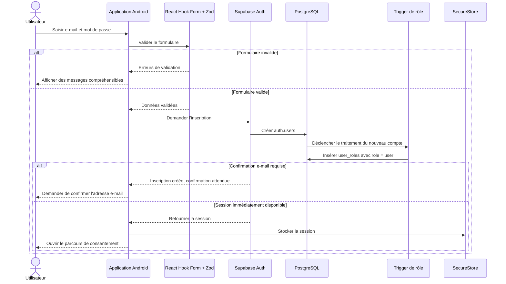
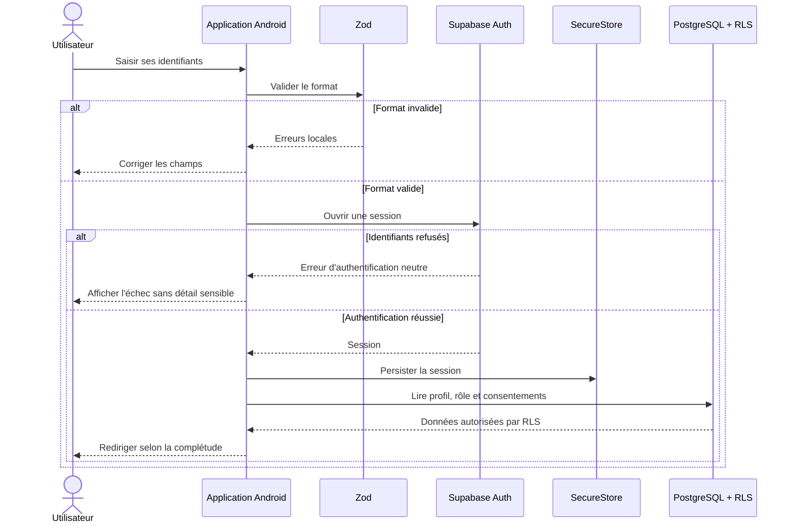
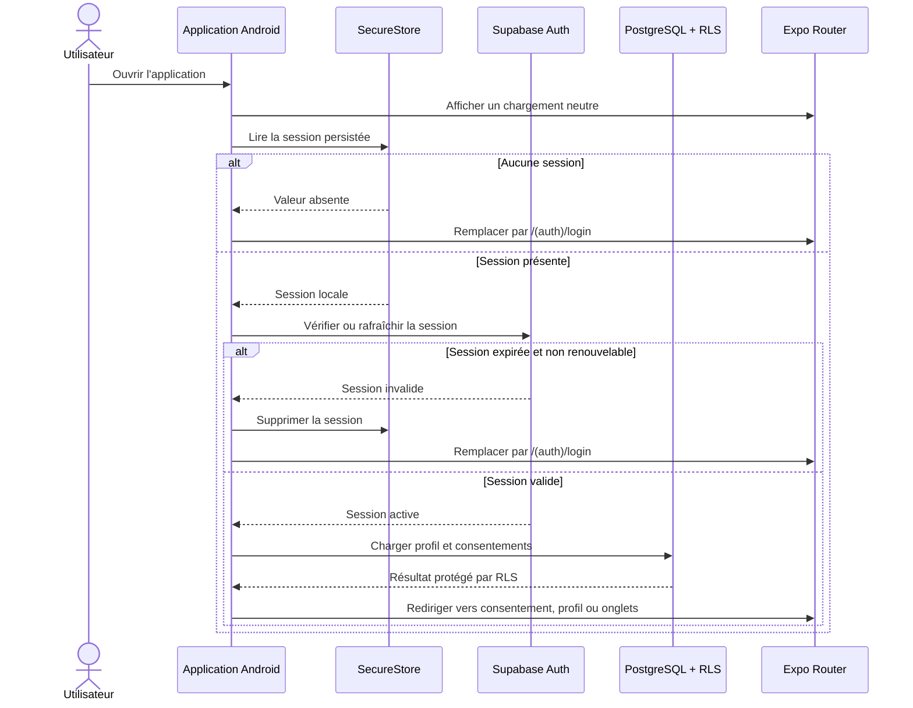
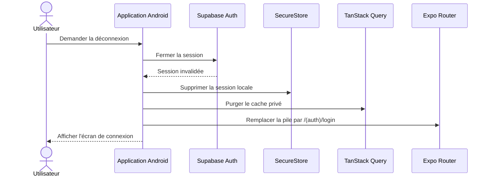

# Séquences d'authentification

Supabase Auth gère l'identité et les sessions. L'application Android ne crée ni ne modifie directement les rôles.

## Inscription et rôle initial



Le trigger est contrôlé côté Supabase. Le client ne transmet aucune valeur de rôle. Une promotion vers `admin` exige une opération privilégiée distincte.

## Connexion



## Restauration de session



Une seule décision de navigation est prise après la fin de la restauration afin d'éviter les boucles de redirection.

## Déconnexion



Les jetons et données du cache ne sont jamais journalisés.

## Récupération du mot de passe

```mermaid
sequenceDiagram
    actor U as Utilisateur
    participant A as Application Android
    participant Auth as Supabase Auth
    participant Mail as Messagerie de l'utilisateur
    participant Link as Lien profond Android

    U->>A: Demander la récupération
    A->>Auth: Envoyer la demande pour l'e-mail saisi
    Auth-->>A: Réponse neutre
    A-->>U: Indiquer de consulter sa messagerie
    Auth->>Mail: Envoyer le lien de récupération
    U->>Mail: Ouvrir le message
    Mail->>Link: Ouvrir le lien DRÉPA
    Link->>A: Transmettre les paramètres de récupération
    A->>Auth: Vérifier le contexte de récupération
    alt Lien invalide ou expiré
        Auth-->>A: Refus
        A-->>U: Afficher un message neutre et proposer une nouvelle demande
    else Lien valide
        Auth-->>A: Autoriser le changement
        U->>A: Saisir un nouveau mot de passe
        A->>Auth: Mettre à jour le mot de passe
        Auth-->>A: Confirmation
        A-->>U: Confirmer puis ouvrir la connexion
    end
```

Le lien profond est validé dans un development build et dans l'APK Android.
