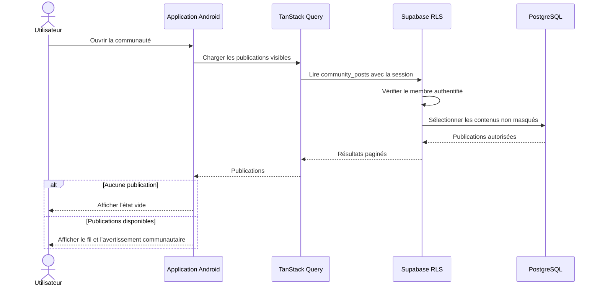
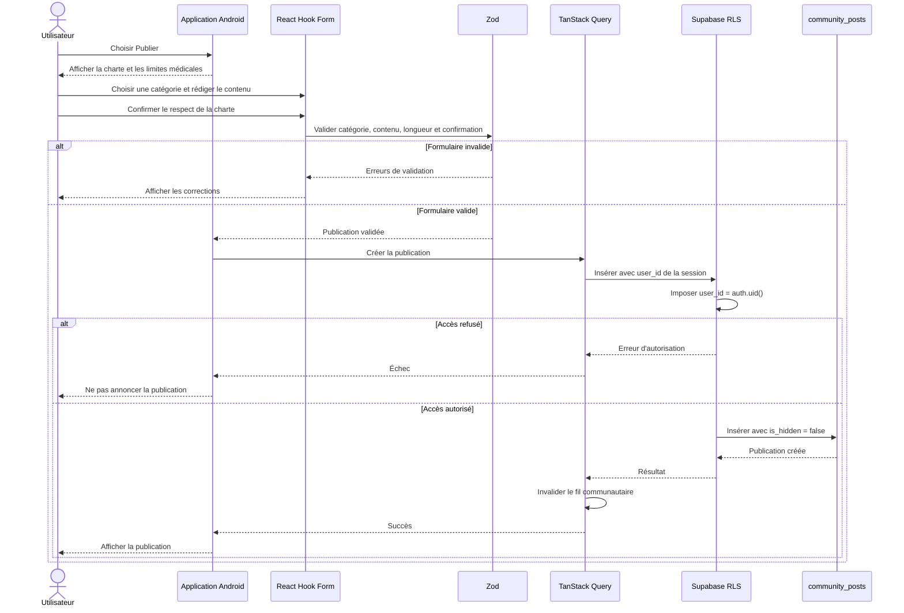
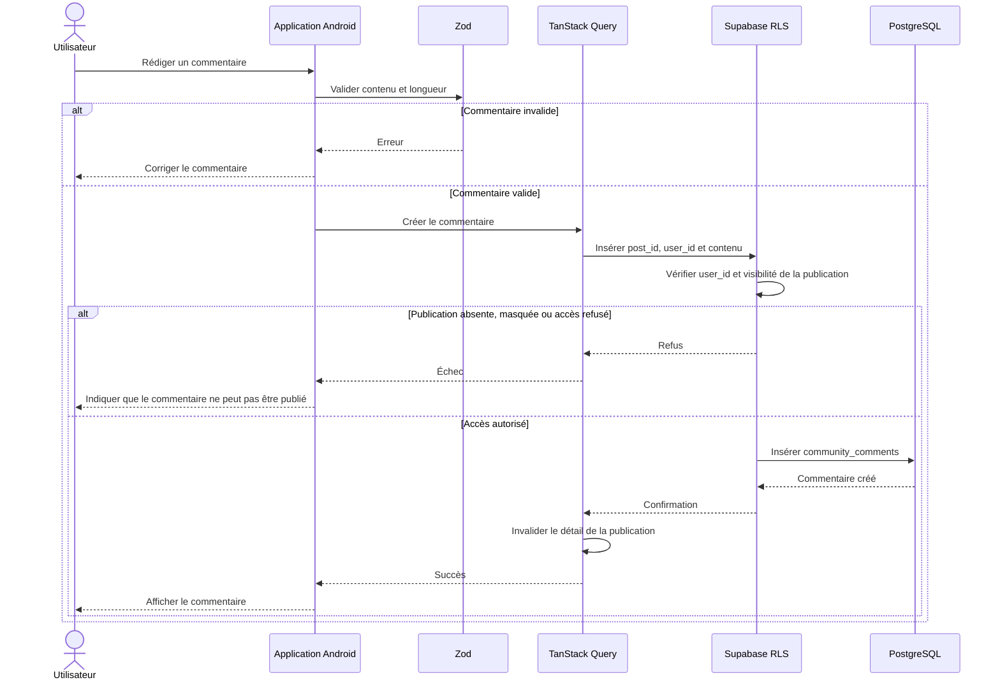
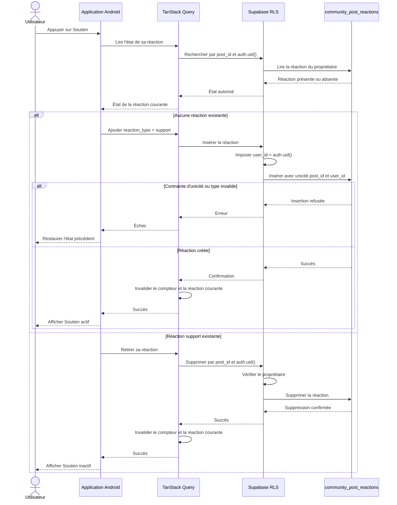
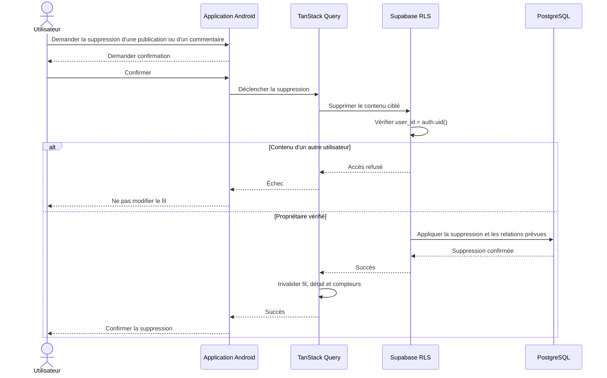
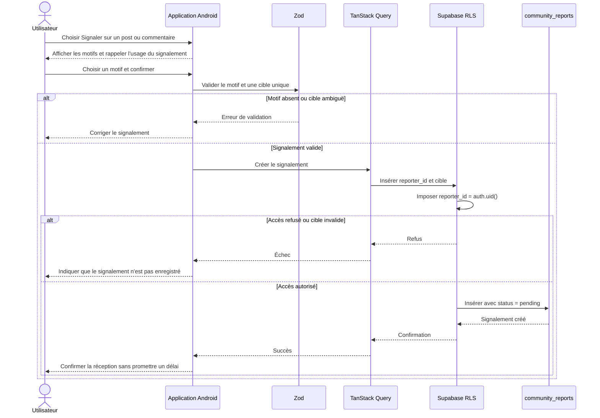

# Séquences de la communauté

La communauté du MVP est limitée aux publications, commentaires, réactions `support`, signalements et suppression de son propre contenu. Les données médicales privées ne sont jamais jointes aux contenus communautaires.

## Consultation des publications

Les témoignages ne remplacent pas l'avis d'un professionnel de santé.

## Création d'une publication

L'application ne transforme pas une publication en conseil médical et n'en valide pas automatiquement le contenu médical.

## Ajout d'un commentaire

## Ajout et retrait d'une réaction `support`

Une seule réaction est autorisée par utilisateur et publication, et son type est toujours `support`.

## Suppression de son contenu

Les politiques de clés étrangères et de conservation des signalements sont définies par les migrations ; le client ne contourne pas ces règles.

## Signalement d'un contenu

Le déclarant ne peut pas modifier le statut du signalement. Son traitement appartient au parcours administrateur sécurisé.

## Erreurs réseau

- Une publication, un commentaire, une réaction, une suppression ou un signalement n'est annoncé comme réussi qu'après confirmation Supabase.
- Les retries sont limités afin d'éviter les créations multiples.
- Les contraintes d'unicité protègent la réaction `support` contre les doubles insertions.
- L'interface conserve un état explicite et permet une nouvelle tentative lorsque cela ne crée pas d'ambiguïté.
- Aucun contenu médical privé n'est ajouté aux journaux d'erreur.
