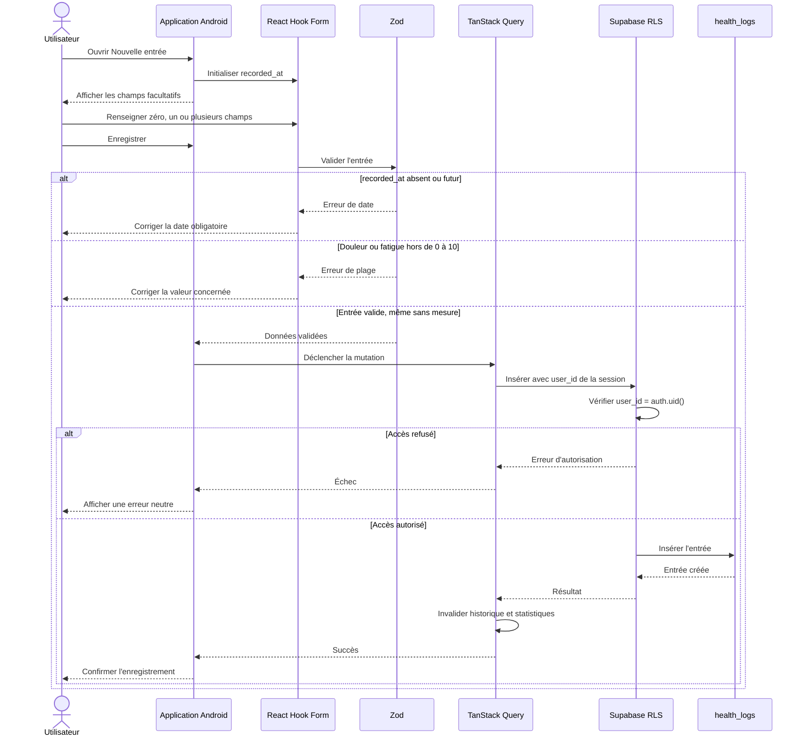
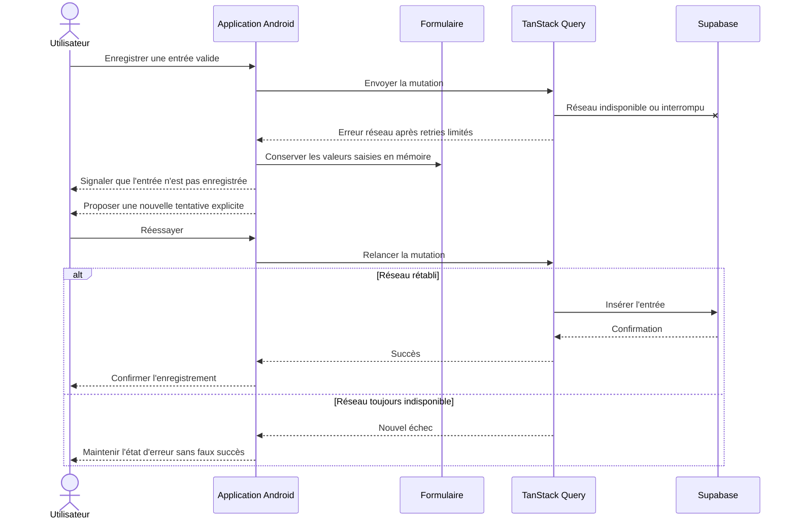
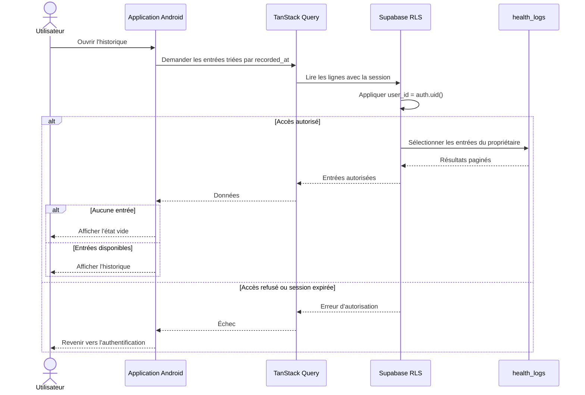
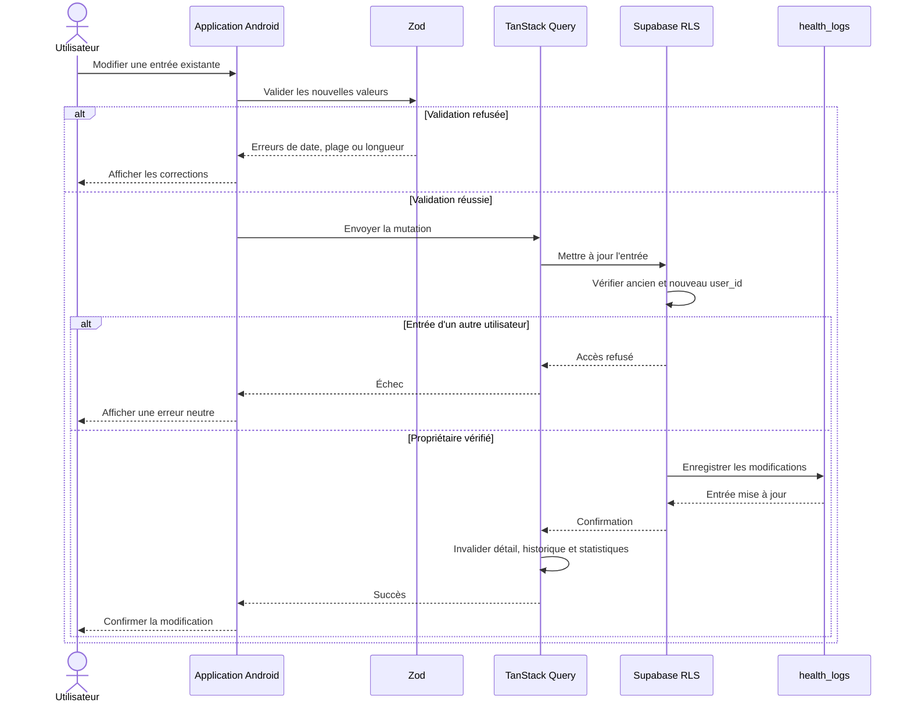
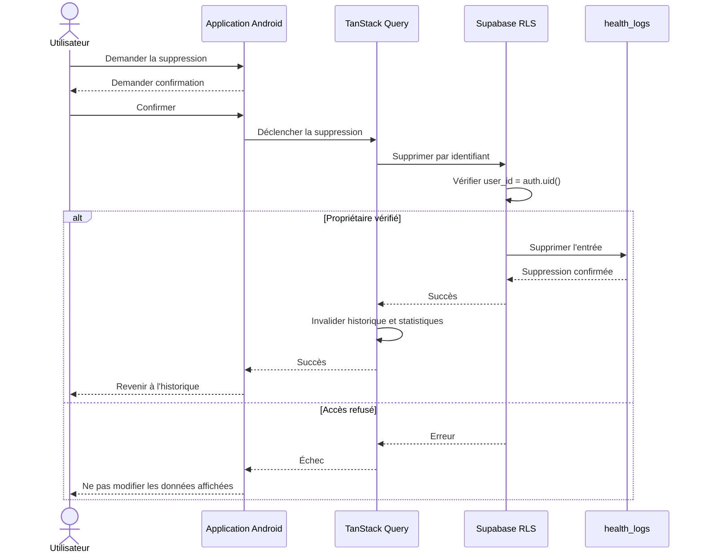

# Séquences du journal de santé

Une entrée peut être partielle. Seul `recorded_at` est obligatoire ; toutes les mesures et observations sont facultatives.

## Création d'une entrée partielle

Champs facultatifs : douleur, localisation, fatigue, température, hydratation, symptômes, facteurs possibles, prise déclarée de médicaments et notes.

## Erreur réseau pendant la sauvegarde

Le MVP ne prétend pas fournir une synchronisation hors ligne complète. Une erreur ne doit jamais être présentée comme une sauvegarde réussie.

## Consultation de l'historique

Les statistiques calculées à partir de cet historique sont uniquement descriptives et ne constituent aucune interprétation médicale.

## Modification d'une entrée

## Suppression d'une entrée

Le journal enregistre des informations déclarées par l'utilisateur. Il ne fournit aucun diagnostic, aucune prescription et aucune prédiction de crise.
