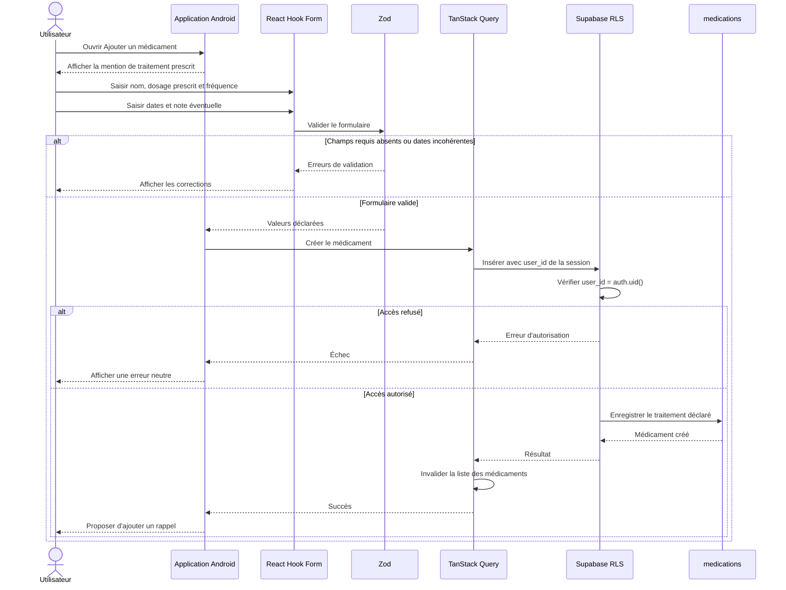
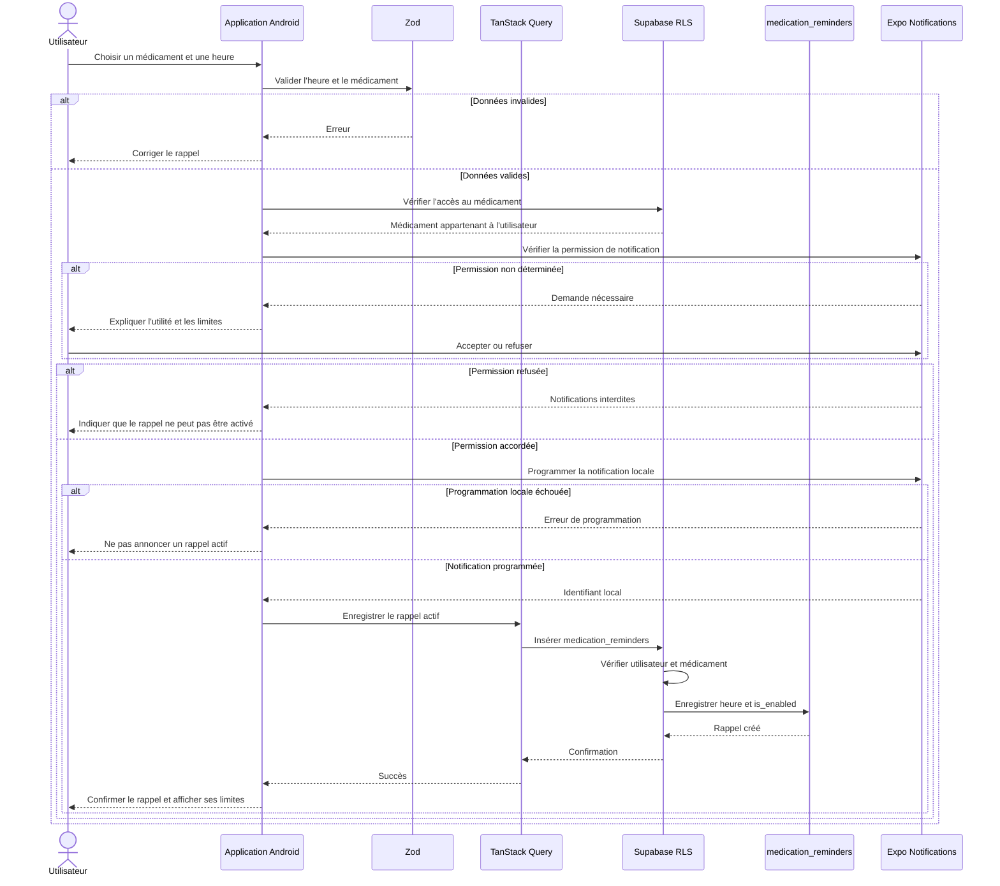
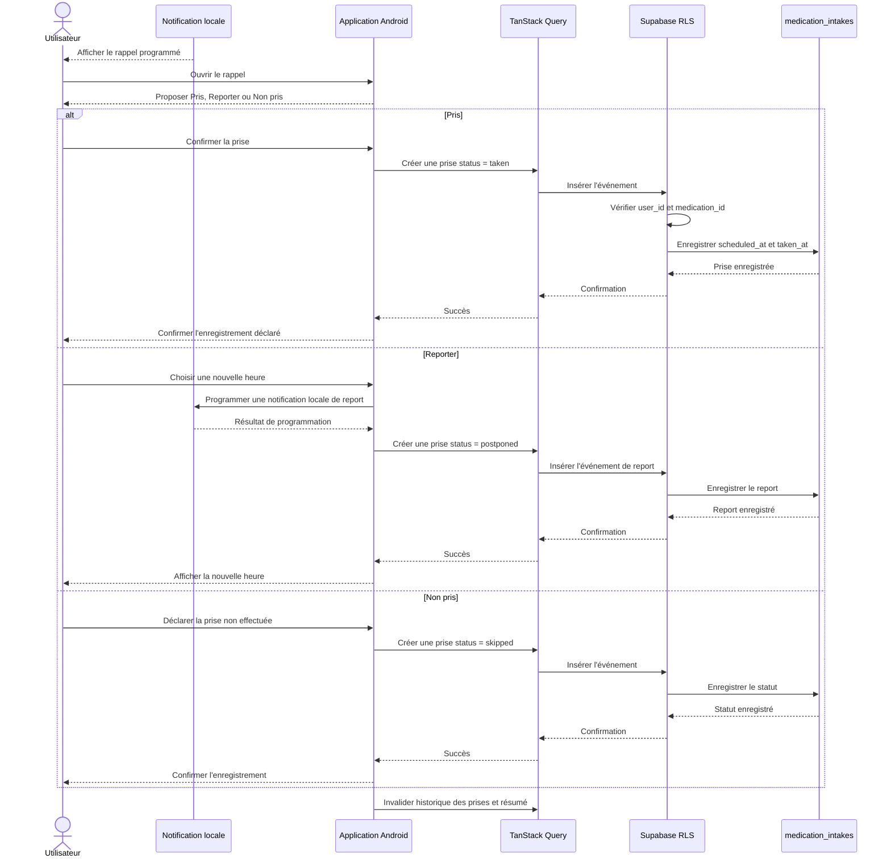
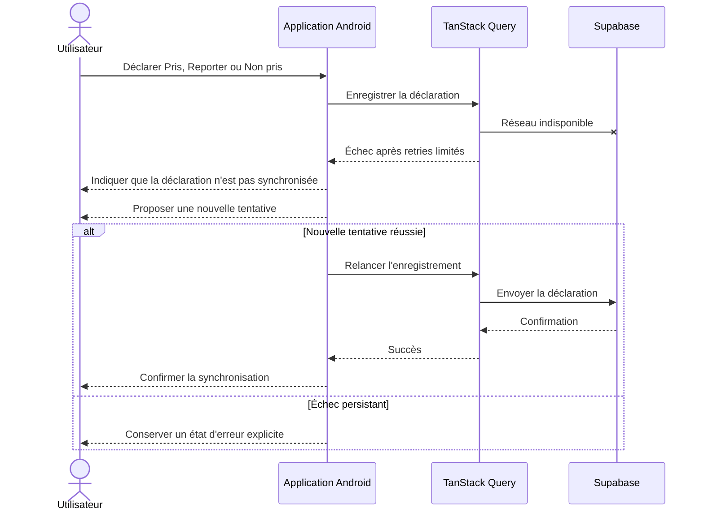
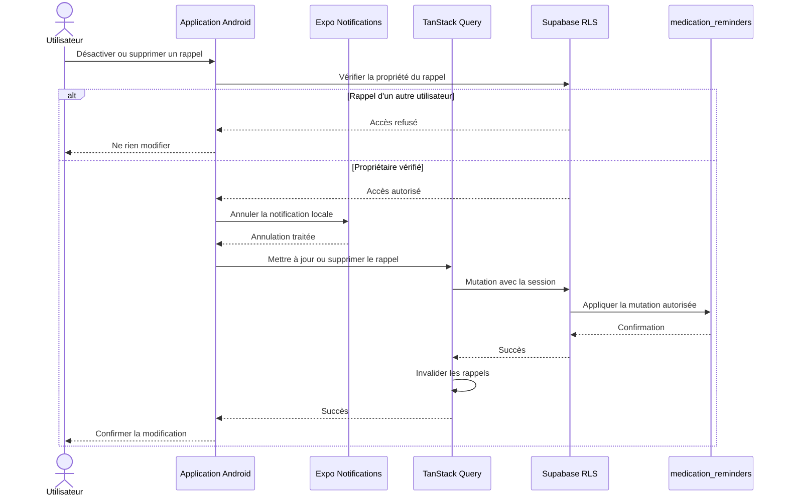

# Séquences des médicaments et rappels

Le module aide l'utilisateur à organiser un traitement qu'il déclare comme prescrit. Il ne recommande aucun médicament, aucun dosage et aucune modification de traitement.

## Ajout d'un traitement déclaré

L'application conserve le texte saisi par l'utilisateur sans valider médicalement le médicament ou son dosage.

## Programmation d'un rappel local

Si l'enregistrement distant échoue après la programmation locale, l'application annule la notification nouvellement créée ou indique explicitement l'état à corriger afin d'éviter un rappel fantôme.

## Déclenchement et confirmation d'une prise

L'absence d'interaction avec une notification n'est pas automatiquement interprétée comme une prise manquée. Le statut `skipped` résulte d'une déclaration explicite de l'utilisateur.

## Erreur réseau lors d'une confirmation

Un affichage local ne doit jamais faire croire qu'une confirmation a été sauvegardée dans Supabase lorsqu'elle ne l'a pas été.

## Désactivation ou suppression d'un rappel

## Limites

- Les notifications peuvent être empêchées par les permissions, l'arrêt du téléphone, l'économie d'énergie ou la désinstallation.
- Un rappel est une aide d'organisation et ne garantit pas la prise.
- Les prises enregistrées sont des déclarations de l'utilisateur.
- L'application ne prescrit pas, ne recommande pas de dosage, ne modifie pas un traitement et ne conseille jamais son arrêt.
