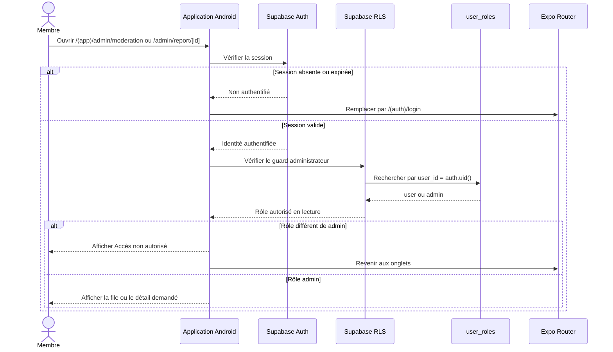
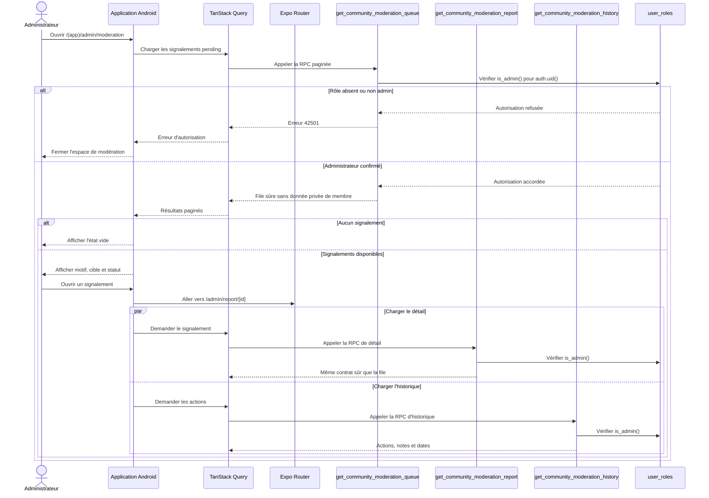
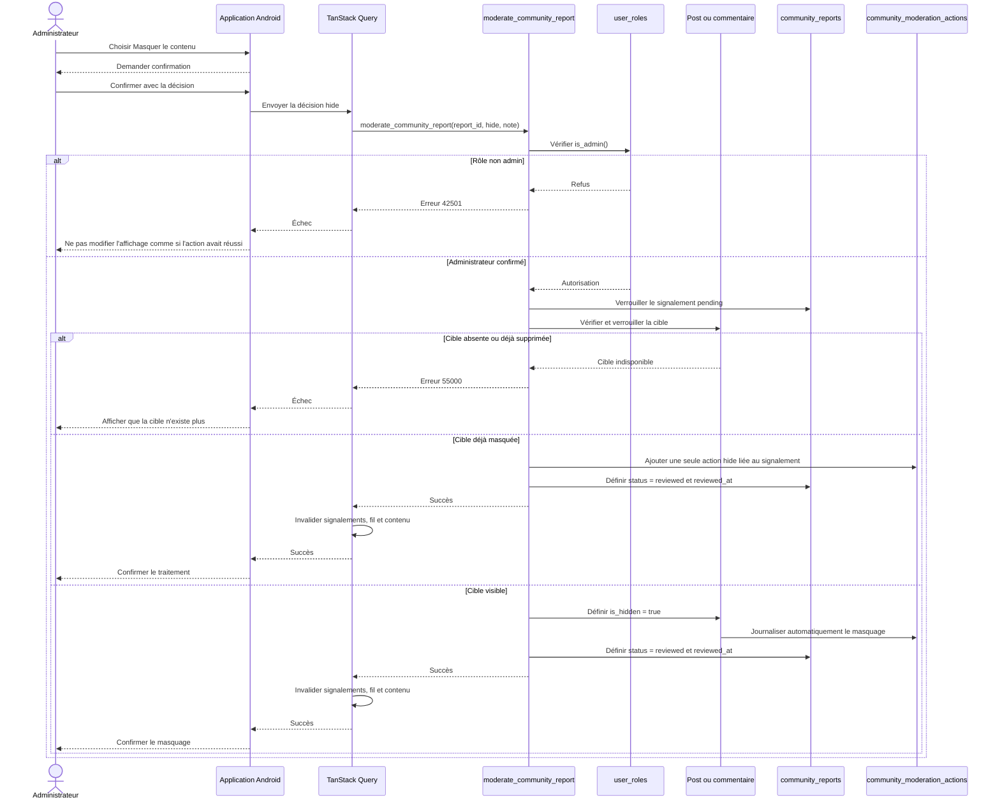
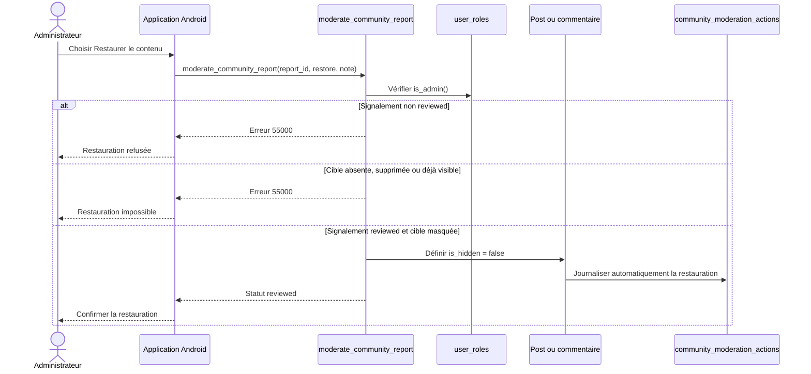
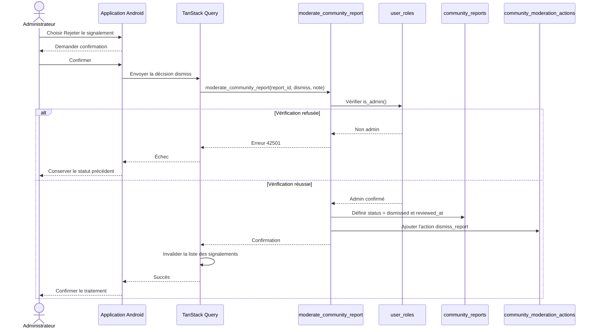
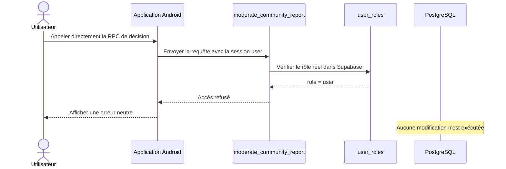
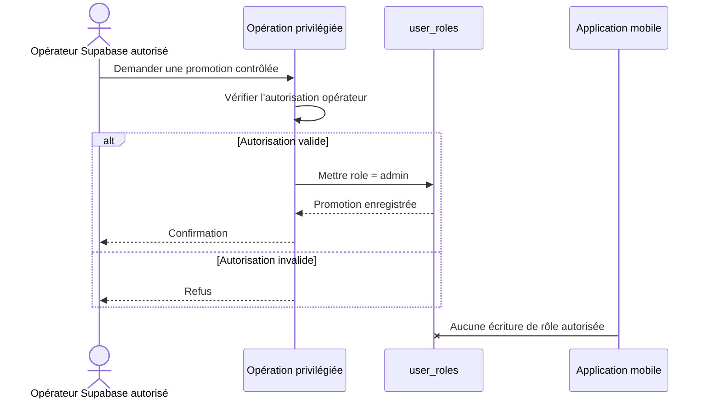

# Séquences de modération

La modération du MVP traite les signalements avec les statuts `pending`, `reviewed` et `dismissed`. Elle permet de masquer ou restaurer une publication ou un commentaire, ou de rejeter un signalement. Chaque autorisation administrative est vérifiée côté Supabase ; l'interface mobile ne peut pas accorder le rôle `admin`.

## Accès à l'espace de modération

Le layout `admin` utilise le rôle propre au compte dans `user_roles` comme guard. Cette redirection améliore l'expérience, mais chaque RPC vérifie aussi `is_admin()` côté Supabase.

## Consultation des signalements

Les lectures passent uniquement par `get_community_moderation_queue`, `get_community_moderation_report` et `get_community_moderation_history`. Elles ne donnent aucun accès global au journal de santé, aux contacts, aux médicaments ou aux événements SOS.

## Masquage d'un contenu signalé

Le masquage ne supprime pas automatiquement le compte de l'auteur et ne constitue pas une décision médicale. Le journal d'audit est immuable depuis le mobile.

## Restauration d'un contenu

Une restauration est réservée à un signalement déjà `reviewed`. Les signalements `pending` et `dismissed` sont refusés avant toute modification.

## Rejet d'un signalement

Un signalement `dismissed` ne modifie pas la visibilité du contenu. La décision passe toujours par `moderate_community_report`.

## Tentative administrative depuis un compte utilisateur

Même un client modifié ou un appel direct à l'API reste soumis à cette vérification. Aucun `UPDATE` direct de `community_reports` ou du journal d'audit n'est accordé au mobile.

## Promotion vers administrateur

L'application mobile peut adapter son interface après lecture du rôle, mais elle ne peut jamais promouvoir un compte.

## États et erreurs

- `pending` : signalement en attente de traitement.
- `reviewed` : signalement traité, notamment après un masquage confirmé ; une restauration conserve cet état.
- `dismissed` : signalement examiné puis rejeté sans modifier la visibilité.
- Les lectures administratives utilisent les RPC de file, détail et historique.
- Les décisions utilisent uniquement `moderate_community_report` ; aucune mise à jour directe n'est autorisée.
- Chaque masquage, restauration ou rejet ajoute une action au journal d'audit immuable.
- Une erreur réseau ne change pas localement le statut comme si la mutation avait réussi.
- Les mutations administratives invalident les caches du fil, du contenu et des signalements.
- Les erreurs ne révèlent ni jeton, ni donnée médicale privée, ni privilège serveur.
- La modération reste humaine et basique dans le MVP ; aucune modération automatisée n'est incluse.
