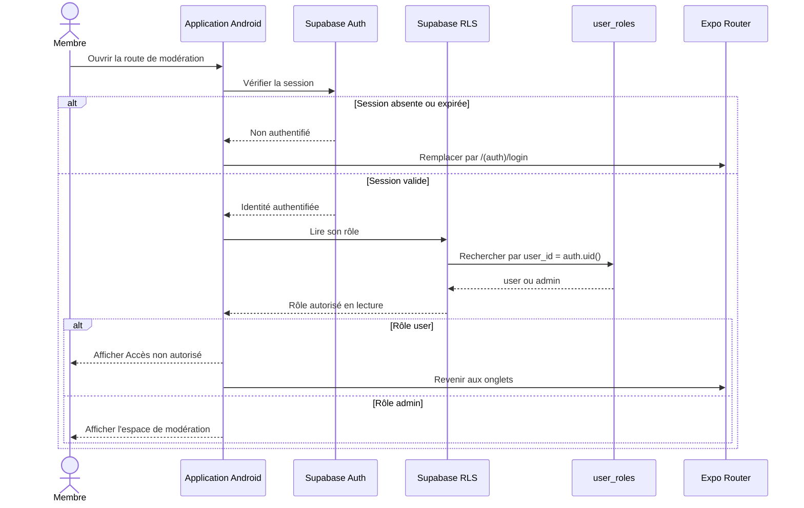
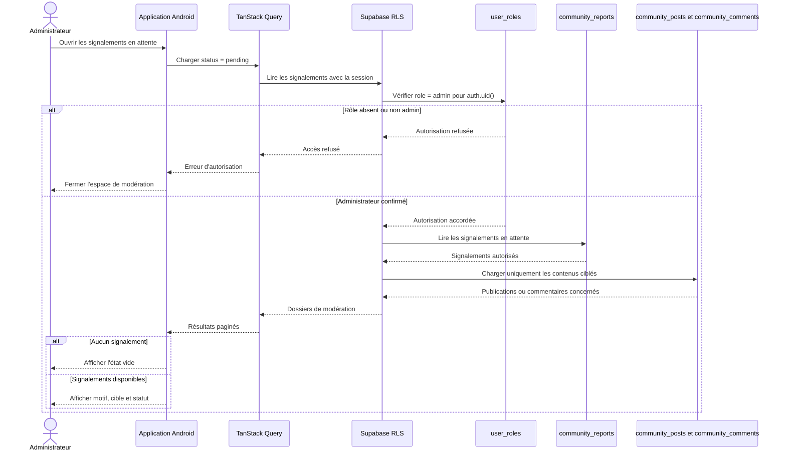
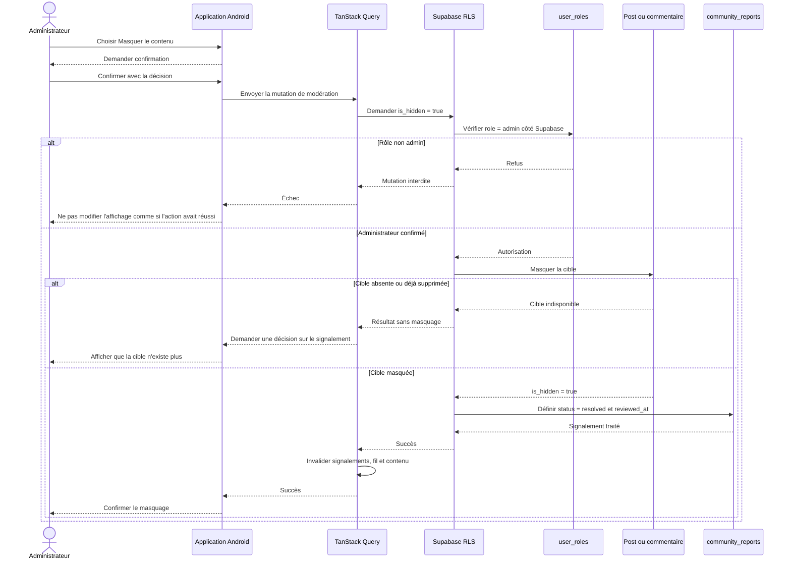
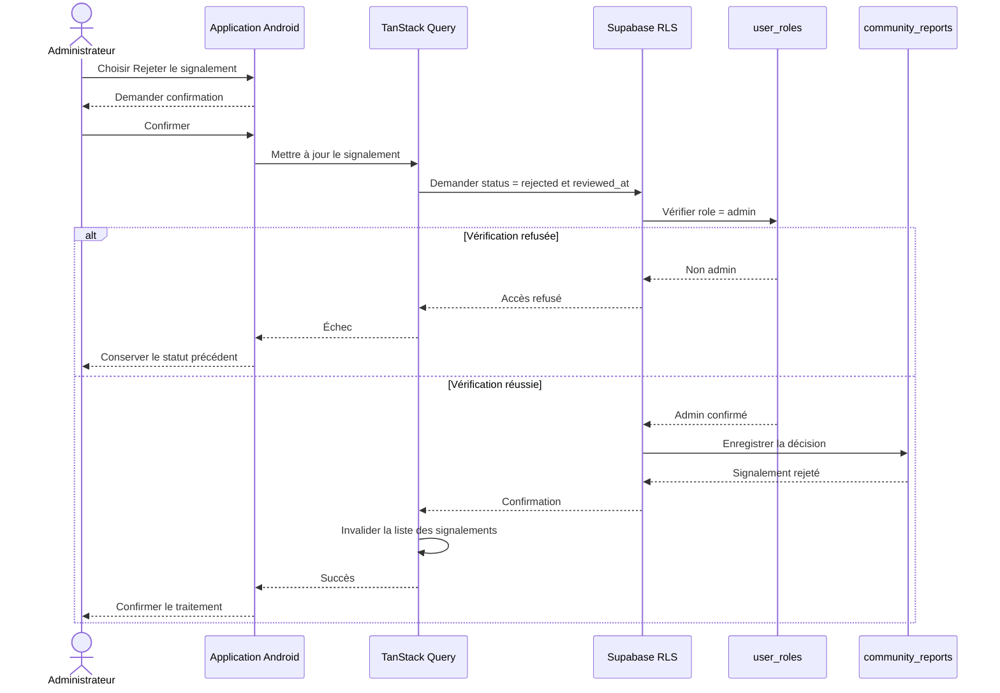
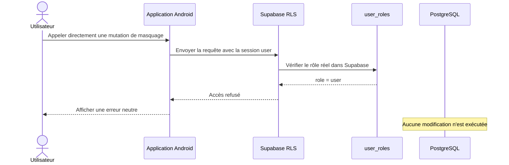
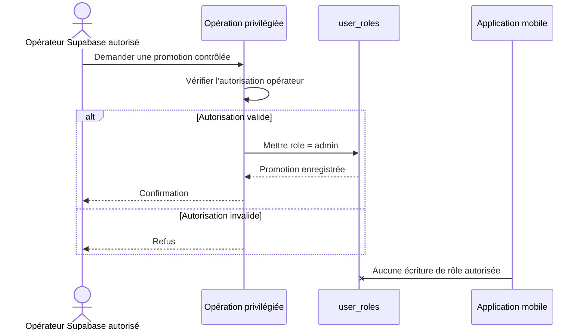

# Séquences de modération

La modération du MVP traite les signalements et permet de masquer une publication ou un commentaire. Chaque autorisation administrative est vérifiée côté Supabase ; l'interface mobile ne peut pas accorder le rôle `admin`.

## Accès à l'espace de modération

Cette redirection améliore l'expérience, mais ne remplace jamais les politiques RLS appliquées à chaque requête administrative.

## Consultation des signalements

L'accès de modération aux contenus communautaires ne donne aucun accès global au journal de santé, aux contacts, aux médicaments ou aux événements SOS.

## Masquage d'un contenu signalé

Le masquage ne supprime pas automatiquement le compte de l'auteur et ne constitue pas une décision médicale.

## Rejet d'un signalement

Un signalement rejeté ne modifie pas la visibilité du contenu.

## Tentative administrative depuis un compte utilisateur

Même un client modifié ou un appel direct à l'API reste soumis à cette vérification.

## Promotion vers administrateur

L'application mobile peut adapter son interface après lecture du rôle, mais elle ne peut jamais promouvoir un compte.

## États et erreurs

- `pending` : signalement en attente de traitement.
- `resolved` : signalement traité, notamment après masquage confirmé.
- `rejected` : signalement examiné sans masquage.
- Une erreur réseau ne change pas localement le statut comme si la mutation avait réussi.
- Les mutations administratives invalident les caches du fil, du contenu et des signalements.
- Les erreurs ne révèlent ni jeton, ni donnée médicale privée, ni privilège serveur.
- La modération reste humaine et basique dans le MVP ; aucune modération automatisée n'est incluse.
