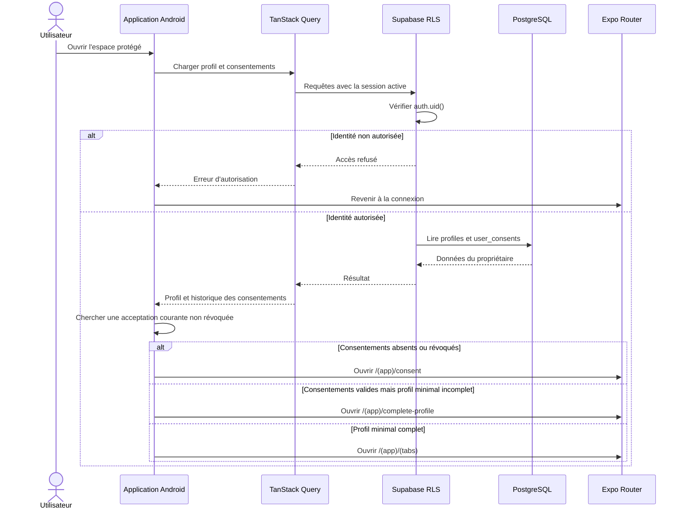
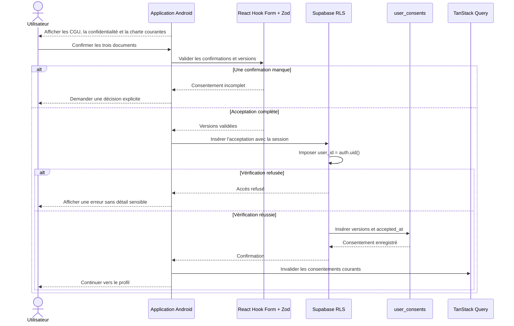
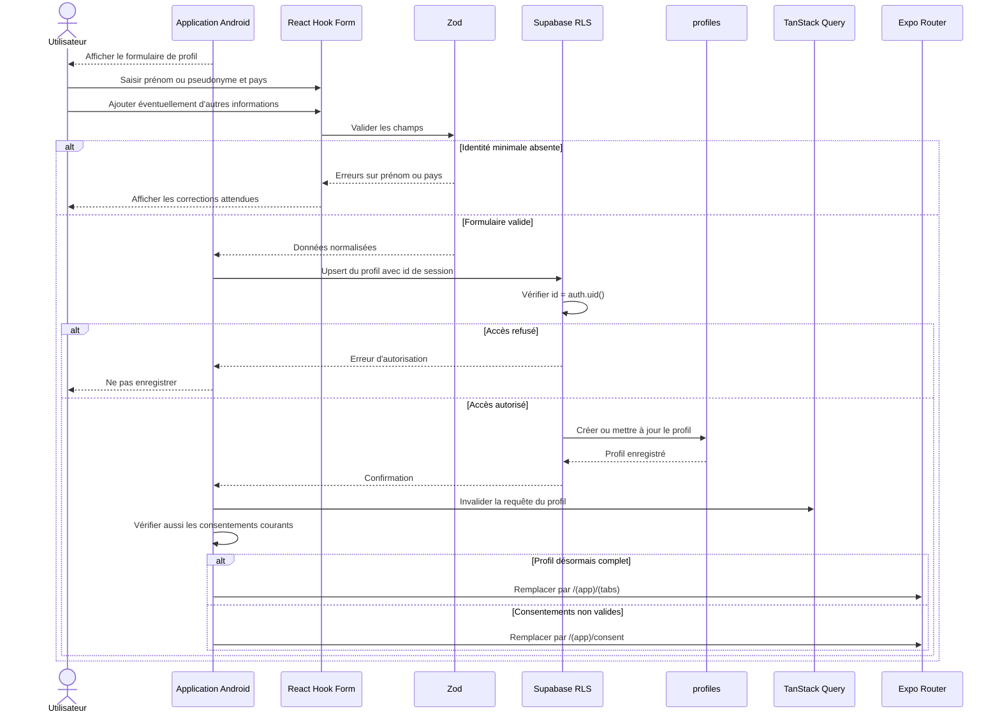
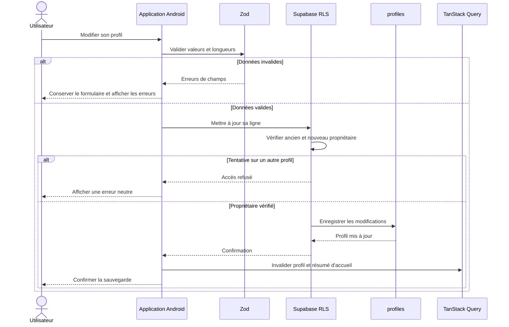
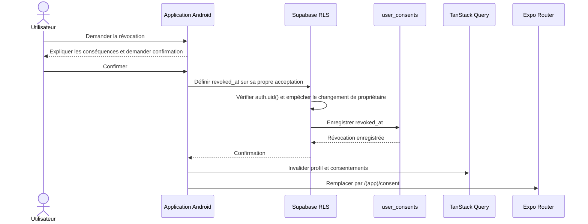

# Séquences du profil et des consentements

Un profil est complet uniquement lorsque le prénom ou pseudonyme, le pays et les consentements obligatoires courants non révoqués sont présents. Les autres informations restent facultatives.

## Chargement et décision de complétude

Le contrôle d'interface n'accorde aucun accès : chaque lecture reste protégée par la RLS.

## Acceptation des consentements

Une nouvelle version produit une nouvelle acceptation. L'historique précédent n'est pas réécrit.

## Création du profil minimal

Les informations médicales facultatives ne sont jamais utilisées pour produire un diagnostic ou recommander un traitement.

## Modification du profil

## Révocation d'un consentement

Après révocation, le profil est considéré incomplet tant qu'une acceptation valide des versions courantes n'est pas enregistrée.
