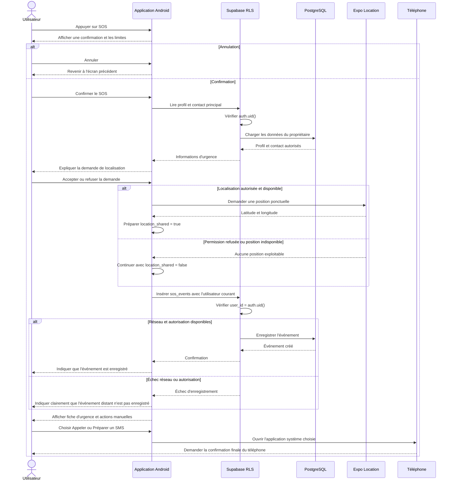
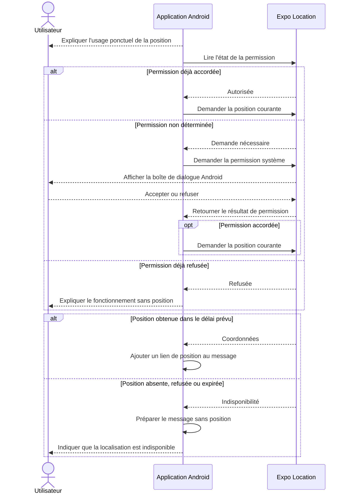
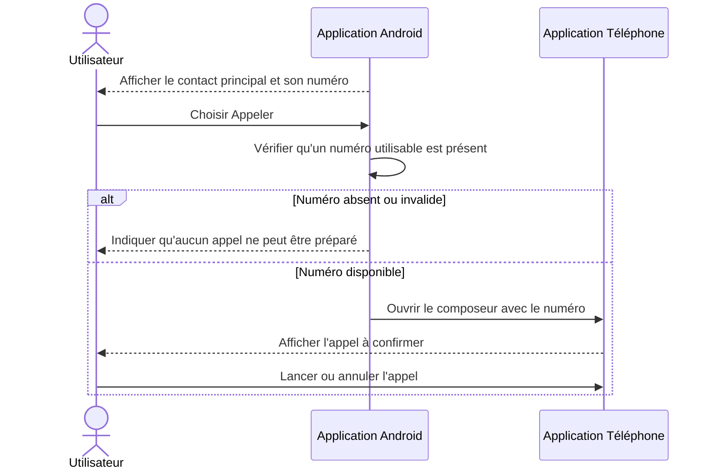
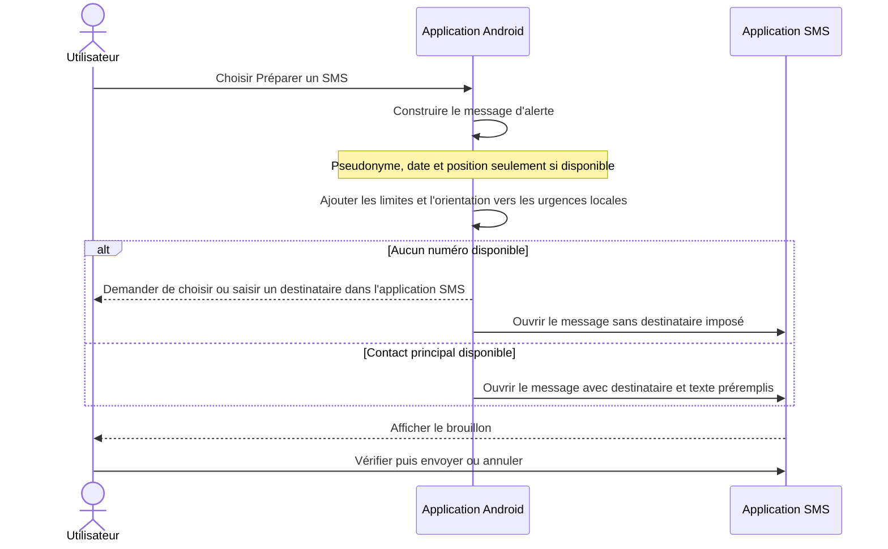
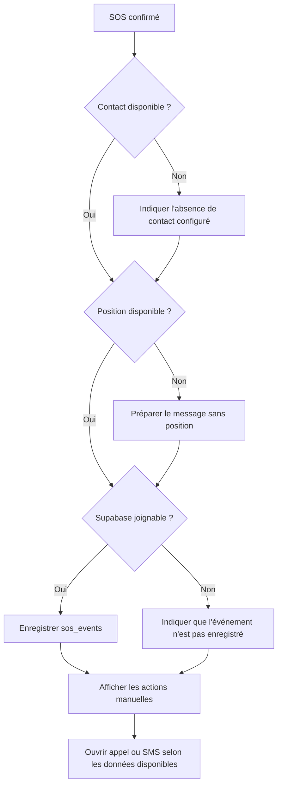

# Séquences du SOS

Le SOS du MVP prépare des actions manuelles. Il ne constitue pas un service d'urgence et ne garantit ni l'enregistrement de l'événement, ni la transmission d'un message, ni l'intervention d'un tiers.

## Déclenchement principal

Les actions d'appel et de SMS restent disponibles même si la localisation ou l'enregistrement Supabase échoue.

## Localisation consentie

Aucune permission de localisation en arrière-plan n'est demandée. Aucune collecte permanente n'est effectuée.

## Appel manuel

L'ouverture du composeur ne prouve pas que l'appel a été lancé, reçu ou traité.

## SMS prérempli

L'application n'envoie jamais automatiquement le SMS et ne peut pas garantir sa livraison.

## Fonctionnement dégradé

## Limites obligatoires à afficher

- Le SOS dépend du téléphone, du réseau, des permissions et de la disponibilité des contacts.
- Une position peut être imprécise ou indisponible.
- Un événement non enregistré dans Supabase ne doit jamais être présenté comme sauvegardé.
- L'appel et le SMS nécessitent une action finale de l'utilisateur.
- En cas de danger immédiat, l'utilisateur doit contacter les services d'urgence locaux ou se rendre dans un centre de santé.
- Aucune information affichée ne constitue un diagnostic, une prescription ou une prédiction de crise.
