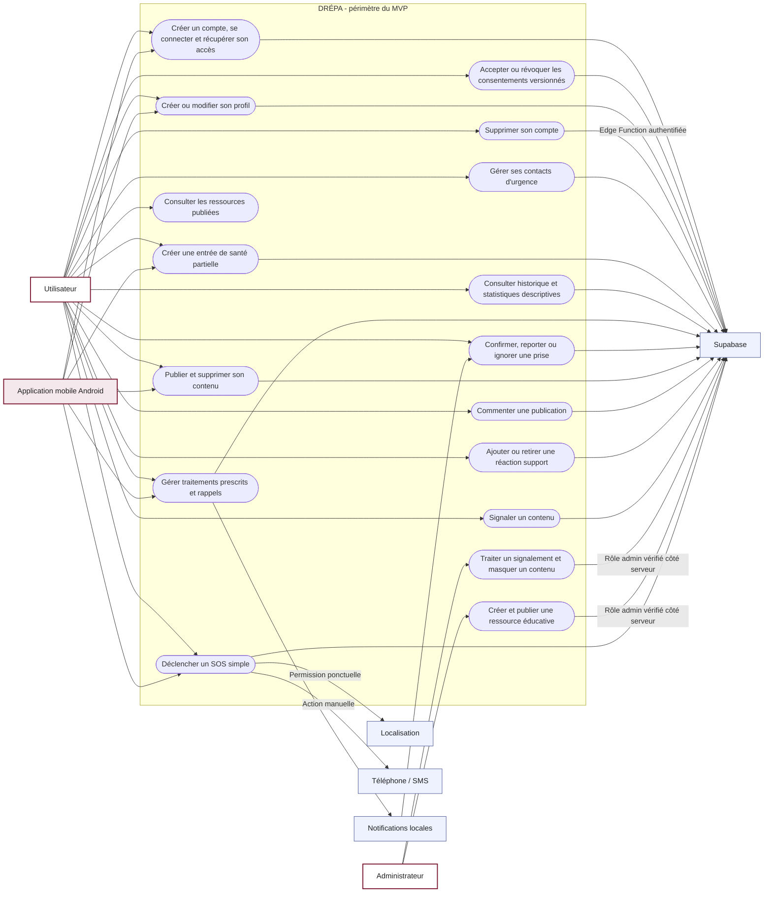

# Cas d'utilisation du MVP

## Acteurs

| Acteur | Responsabilité |
|---|---|
| Utilisateur | Gère son compte, ses données privées et ses interactions communautaires. |
| Administrateur | Traite les signalements, masque les contenus et gère les ressources éducatives. |
| Application mobile | Présente les parcours Android et orchestre les services autorisés. |
| Supabase | Authentifie, conserve les données, applique la RLS et exécute les opérations privilégiées. |
| Notifications locales | Programme et affiche les rappels de médicaments sur le téléphone. |
| Localisation | Fournit ponctuellement une position après consentement. |
| Téléphone | Ouvre l'appel ou l'application SMS à la demande de l'utilisateur. |

## Diagramme

## Règles transversales

- Toutes les données privées sont protégées par RLS et limitées à leur propriétaire.
- Le rôle `user` est attribué automatiquement après l'inscription.
- Le rôle `admin` est accordé uniquement par une opération privilégiée côté Supabase.
- Une réaction communautaire est limitée au type `support`, une fois par utilisateur et publication.
- Une entrée de santé peut être partielle ; seul `recorded_at` est obligatoire.
- Le SOS demande une confirmation et reste utilisable sans localisation.
- L'appel et le SMS restent des actions manuelles de l'utilisateur.
- L'application ne fournit aucun diagnostic, aucune prescription et aucune prédiction de crise.
